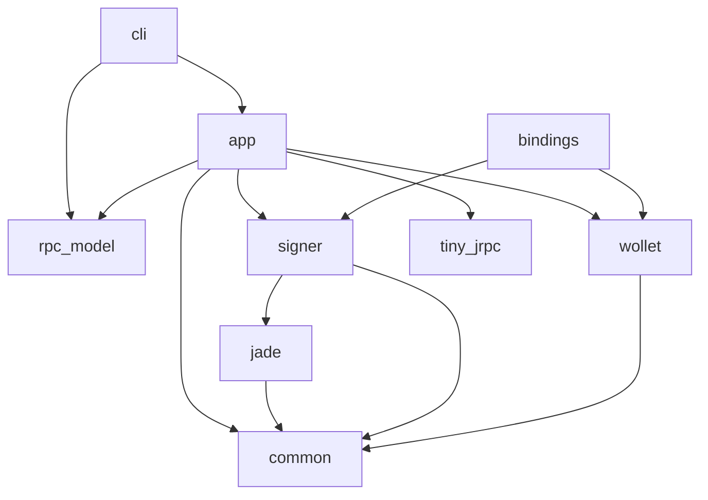

# Liquid Wallet Kit

**WARNING: LWK is still early stage software, use it at your own risk.**

**Liquid Wallet Kit** is a collection of Rust crates for [Liquid](https://liquid.net) Wallets.

## Main Features

* **Watch-Only** wallet support: using Liquid descriptors, better known as
  [CT descriptors](https://github.com/ElementsProject/ELIPs/blob/main/elip-0150.mediawiki).
* **PSET** based: transactions are shared and processed using the
  [Partially Signed Elements Transaction](https://github.com/ElementsProject/elements/blob/1fcf0cf2323b7feaff5d1fc4c506fff5ec09132e/doc/pset.mediawiki) format.
* **Electrum** and **Esplora** [backends](https://github.com/Blockstream/electrs):
  no need to run and sync a full Liquid node or rely on closed source servers.
* **Asset issuance**, **reissuance** and **burn** support: manage the lifecycle
  of your Issued Assets with a lightweight client.
* **Generic multisig** wallets: create a wallet controlled by
  any combination of hardware or software signers, with a user
  specified quorum.
* **Hardware signer** support: receive, issue, reissue and burn L-BTC and
  Issued Assets with your hardware signer, using singlesig or multisig
  wallets (currently [**Jade**](https://blockstream.com/jade/) only, with more coming soon).
* **Native bindings** [PoC support](./lwk_bindings#readme) for Python and Kotlin, with many other language available soon using [uniffi](https://mozilla.github.io/uniffi-rs/)
* **JSON-RPC Server** support: all functions are exposed via JSON-RPC Server, making it easier to build your own frontend, GUI, or integration.

## Building from source

First you need [rust](https://www.rust-lang.org/tools/install),
then you can build from source:
```sh
$ git clone git@github.com:Blockstream/lwk.git
$ cd lwk
$ cargo build --release
$ alias cli="$(pwd)/target/release/lwk_cli"
```

## CLI Usage

Start the rpc server (default in Liquid Testnet)
and put it in background
```sh
$ cli server start &
```

Create a software *signer* named `sw` from a given BIP39 mnemonic
```sh
$ cli signer load-software -s sw --mnemonic "abandon abandon abandon abandon abandon abandon abandon abandon abandon abandon abandon about"
```

Create a p2wpkh *wallet* named `ss` (install [`jq`](https://github.com/jqlang/jq) or extract the descriptor manually)
```sh
$ DESC=$(cli signer singlesig-desc -s sw --descriptor-blinding-key slip77 --kind wpkh | jq -r .descriptor)
$ cli wallet load -w ss -d $DESC
```

Get the wallet balance
```sh
$ cli wallet balance -w ss
```

When you're done, stop the rpc server.
```sh
$ cli server stop
```

### Jade

If you have a Jade, you can plug it in and use it to create a
wallet and sign its transactions.

## Workspace Structure

The projects are split into different component crates that might be useful independently.

Internal crate dependencies are shown in this diagram, where an arrow indicates "depends on":



* [`lwk_cli`](./lwk_cli): a CLI tool to use LWK wallets.
* [`lwk_wollet`](./lwk_wollet): library for watch-only wallets;
  specify a CT descriptor, generate new addresses, get balance,
  create PSETs and other actions.
* [`lwk_signer`](./lwk_signer): interact with Liquid signers
  to get your PSETs signed.
* [`lwk_jade`](./lwk_jade): unlock Jade, get xpubs,
  register multisig wallets, sign PSETs and more.
* [`lwk_bindings`](./lwk_bindings): use LWK from other languages.
* and more:
  common or ancillary components ([`lwk_common`](./lwk_common),
  [`lwk_rpc_model`](./lwk_rpc_model), [`lwk_tiny_rpc`](./lwk_tiny_rpc),
  [`lwk_app`](./lwk_app)),
  future improvements ([`lwk_hwi`](./lwk_hwi)),
  testing infrastructure ([`lwk_test_util`](./lwk_test_util),
  [`lwk_containers`](./lwk_containers))

For instance, mobile app devs might be interested mainly in
`lwk_bindings`, `lwk_wollet` and `lwk_signer`.
While backend developers might want to directly use `lwk_cli`
in their systems.

## Tests

Run unit tests:
```
cargo test --lib
```

End-to-end tests need some local servers:

```
./context/download_bins.sh # needed once unless server binaries changes
. .envrc  # not needed if you use direnv and you executed `direnv allow`
```

And also the following docker images:

```
docker pull xenoky/local-jade-emulator:1.0.23
docker pull tulipan81/blind_pin_server:v0.0.3
```

Note: Failed test executions can leave docker containers running. To stop all running containers run:

```
docker stop $(docker ps -a -q)
```

To run end-to-end tests:

```
cargo test
```

To see log outputs use `RUST_LOG` for example

```
RUST_LOG=info cargo test -- test_name
RUST_LOG=jade=debug cargo test -- test_name  # filter only on specific module
```

### Test with a physical Jade

Tests using Jade over serial (via USB cable) need an additional dependency:
```
apt install -y libudev-dev
```

These serial tests cannot be executed in parallel, so we need the `--test-threads 1` flag.
```
cargo test -p lwk_jade --features serial -- serial --include-ignored --test-threads 1
cargo test -p lwk_wollet --features serial -- serial --include-ignored --test-threads 1
```

## Docs

To generate documentation you can use

```
cargo doc --no-deps --open
```

## History

BEWallet was [originally](https://github.com/LeoComandini/BEWallet/)
an Elements/Liquid wallet library written in Rust to develop
prototypes and experiments.

BEWallet was based on [Blockstream's GDK](https://github.com/Blockstream/gdk).
Essentially some GDK Rust pieces were moved to this project.

This was used as the starting point for the Liquid Wallet Kit project.
Parts that were not necessary have been dropped,
many things have been polished, and new features have been added.

The codebase has been entirely re-written, and now it has
almost no similarity with the original code.
