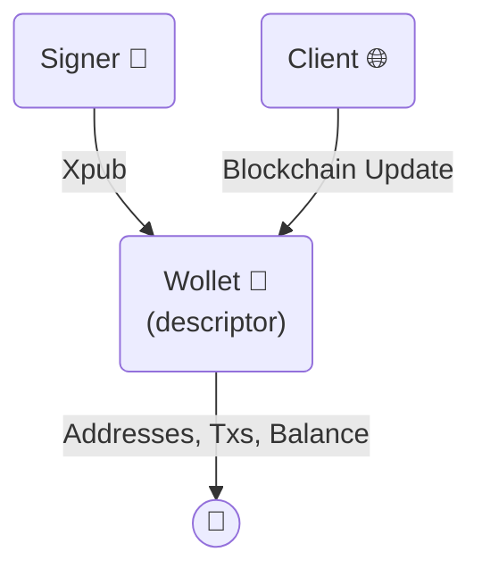
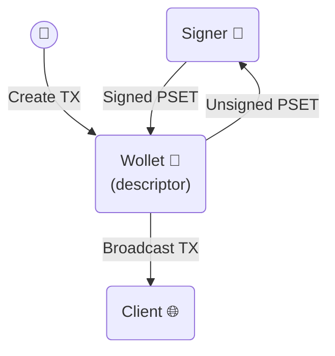
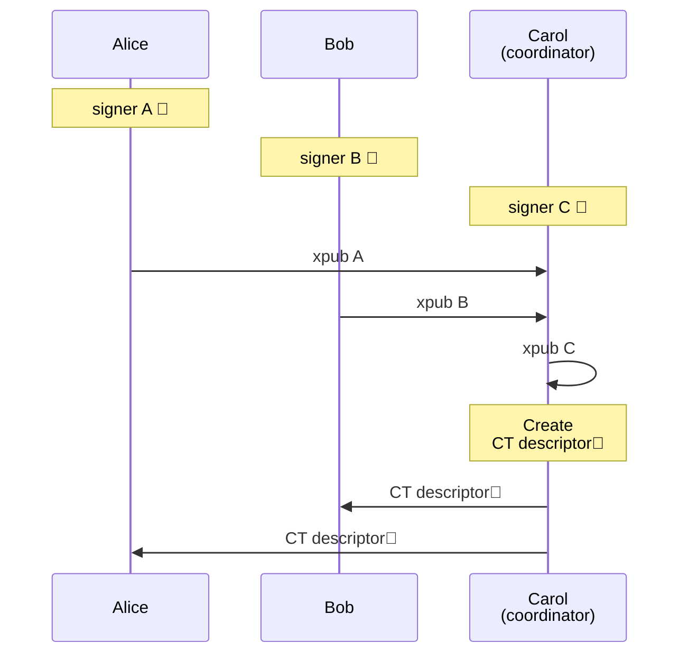
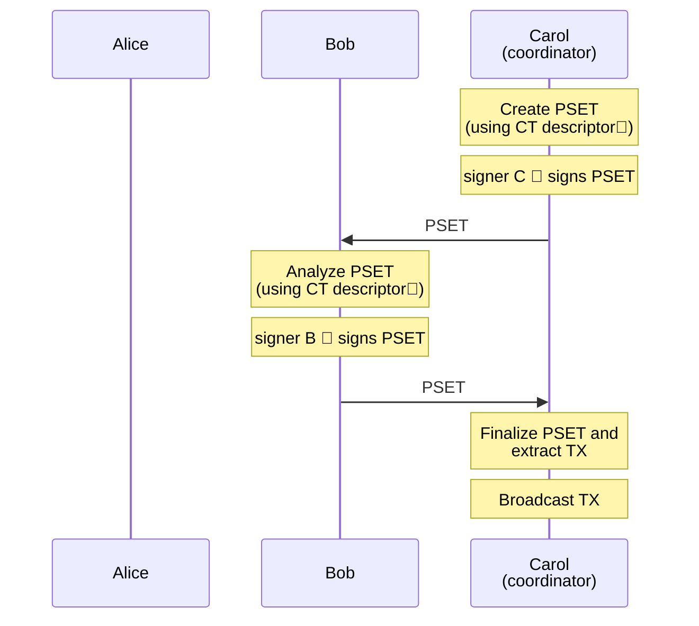
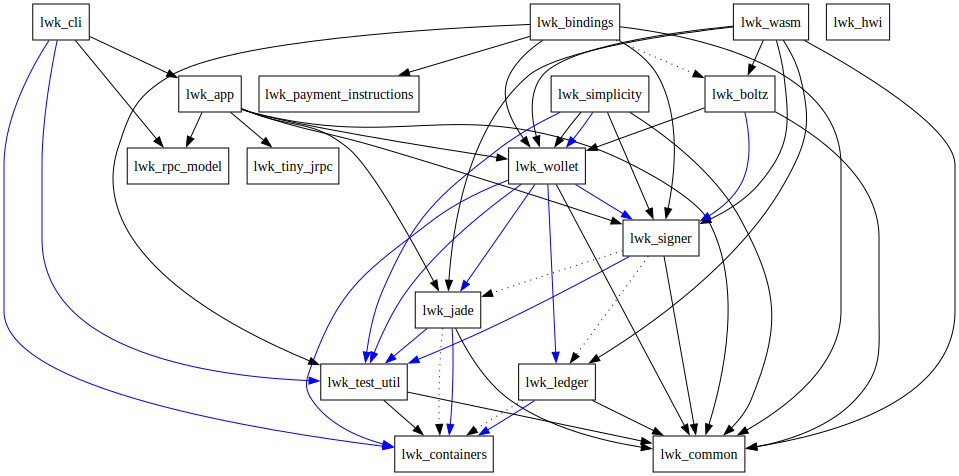
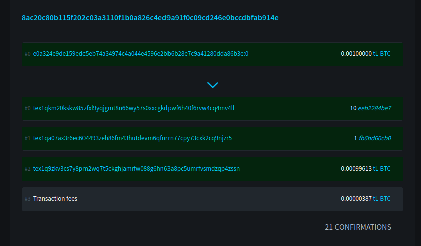

<!-- Generated by docs/generate_llms.py; do not edit manually. -->

# LWK Documentation

This file merges the LWK mdBook documentation into one Markdown document for LLM context. The human-readable HTML book is available at [./](./).

## Table of Contents

- [About LWK](#about-lwk)
- [Features](#features)
- [Installing LWK](#installing-lwk)
- [LWK Basics](#lwk-basics)
- [Signers](#signers)
- [Watch-Only Wallets](#watch-only-wallets)
- [Update the Wallet](#update-the-wallet)
- [Transaction Creation](#transaction-creation)
- [Transaction Signing](#transaction-signing)
- [Transaction Broadcast](#transaction-broadcast)
- [Blockchain Clients](#blockchain-clients)
- [Liquid Multisig](#liquid-multisig)
- [Issuance](#issuance)
- [Reissuance](#reissuance)
- [Burn](#burn)
- [Manual Coin Selection](#manual-coin-selection)
- [Add External Inputs](#add-external-inputs)
- [Send All Funds](#send-all-funds)
- [AMP0 in LWK](#amp0-in-lwk)
- [LiquiDEX](#liquidex)
- [BIP85](#bip85)
- [CLI](#cli)
- [High-Volume Wallets](#high-volume-wallets)
- [LWK Structure](#lwk-structure)
- [Users of LWK](#users-of-lwk)
- [LWK History](#lwk-history)
- [C#](#c)
- [LWK Demo](#lwk-demo)
- [Docs](#docs)
- [Kotlin](#kotlin)
- [Nix](#nix)
- [Python](#python)
- [Rust](#rust)
- [Swift](#swift)
- [Tests](#tests)
- [WASM](#wasm)

---

## About LWK

The Liquid Wallet Kit (LWK) is a comprehensive toolkit that empowers developers to build a new generation of wallets and applications for the Liquid Network. Instead of grappling with the intricate, low-level details of Liquid's confidential transactions, asset management, and cryptographic primitives, LWK provides a powerful set of foundational building blocks. These tools are functional and secure, helping you build your projects with confidence.

LWK's primary goal is to abstract away complexity by handling the most challenging aspects of Liquid development, such as:
* **Confidential Transactions** handling, which automatically obscures amounts and asset types to maintain user privacy.
* **Asset issuance and management**, providing a seamless way to create and interact with new digital assets.
* **Signing Liquid transactions**, allowing for interaction with software signers and hardware wallets.

By providing these building blocks, LWK liberates developers from building Liquid functionality from scratch. This allows them to significantly accelerate development time and focus on creating unique, value-added features for their specific use cases, whether it's building a mobile wallet, integrating Liquid in an exchange, or developing a DeFi application. Ultimately, LWK is the definitive, go-to library for anyone committed to innovating on the Liquid Network.

### Example: single-sig mobile wallet

This example application showcases how the Liquid Wallet Kit (LWK) simplifies the development of a single-signature mobile wallet. The two diagrams below illustrate the key user flows: Wallet Creation and Transaction Management. LWK handles the complex, low-level interactions with the Liquid blockchain and cryptographic operations, allowing the application to focus on the user interface and experience.

#### Wallet Creation

The mobile app starts by creating a new software `signer` and helps the user back up the corresponding BIP39 mnemonic. From this signer, the app extracts the `xpub` to derive a single-signature [CT descriptor](https://github.com/ElementsProject/ELIPs/blob/main/elip-0150.mediawiki) (e.g., `ct(slip77(...),elwpkh([...]xpub/<0;1>/*))`).

This CT descriptor is then used to initialize a `wollet`, which is LWK's watch-only wallet. The `wollet` allows the app to fetch addresses, transactions, and the current balance to display in the user interface.

When the app is opened, it uses a `client` to sync the wollet with the latest blockchain information. This ensures the wallet data is up-to-date.



#### Transaction Management

The mobile app enables users to send funds by allowing them to specify the amount, asset, and destination address. The `wollet` then takes this information to create an unsigned transaction, which is encoded in the [PSET](https://github.com/ElementsProject/ELIPs/blob/main/elip-0150.mediawiki) format.

The PSET is passed to the `signer`, which uses its private keys to sign the transaction. Once the PSET is signed, it's finalized into a complete transaction, which the `client` then broadcasts to the Liquid Network.



#### Remarks
This simple example highlights the core responsibilities of each LWK component:
* **Signer** 🔑: Manages private keys and handles all signing operations.
* **Wollet** 👀: Provides a watch-only view of the wallet, deriving addresses and tracking transactions and balances without holding any private keys.
* **Client** 🌐: Fetch blockchain data from the Liquid Network to update the `wollet`.

### Key Features
LWK allows to build more complex applications and products by leveraging its wide range of features:
* [x] Send and receive LBTC
* [x] Send and receive Liquid Issued Assets (e.g. USDT)
* [x] Send and receive AMP assets (e.g. BMN)
* [x] Software signers
* [x] Hardware wallets support (Jade)
* [x] Watch-Only view with CT descriptors
* [x] Single-sig
* [x] Generic Multisig
* [x] Multi-language support (Swift, Kotlin, Javascript, Typescript, Wasm, React Native, Go, C#, Rust, Flutter/Dart, Python)

For a more complete and detailed list of LWK features see [here](#features).

### Get started

[Install LWK](#installing-lwk) and go through our [tutorial](#lwk-basics).

---

## Features

* **Watch-Only** wallet support: using Liquid descriptors, better known as
  [CT descriptors](https://github.com/ElementsProject/ELIPs/blob/main/elip-0150.mediawiki).
* **PSET** based: transactions are shared and processed using the
  [Partially Signed Elements Transaction](https://github.com/ElementsProject/elements/blob/1fcf0cf2323b7feaff5d1fc4c506fff5ec09132e/doc/pset.mediawiki) format.
* [**Electrum**, **Esplora**](https://github.com/Blockstream/electrs) and [Waterfalls](https://github.com/RCasatta/waterfalls):
  no need to run and sync a full Liquid node or rely on closed source servers.
* **Asset issuance**, **reissuance** and **burn** support: manage the lifecycle
  of your Issued Assets with a lightweight client.
* **Generic multisig** wallets: create a wallet controlled by
  any combination of hardware or software signers, with a user
  specified quorum.
* **Hardware signer** support: receive, issue, reissue and burn L-BTC and
  Issued Assets with your hardware signer, using singlesig or multisig
  wallets (currently [**Jade**](https://blockstream.com/jade/) only, with more coming soon).
* **Multi Language** support: Swift, Kotlin, Javascript, Typescript, WASM, React Native, Go, C#, Rust, Flutter/Dart and Python. 
* **Liquid Atomic Swaps**: using [LiquiDEX](https://blog.blockstream.com/liquidex-2-step-atomic-swaps-on-the-liquid-network/).
* **Blockstream AMP** support: send and receive asset issued with the [Blockstream Asset Management Platform](https://blockstream.com/amp/).
* **Boltz integration**: pay and receive Lightning invoices and perform LBTC/BTC swaps with [Boltz Exchange](https://github.com/boltzexchange) integration.
* **...and more!**

---

## Installing LWK

LWK is available for several languages.

### Rust
You can use the crates released on [crates.io](https://crates.io)

```rust
[dependencies]
lwk_wollet = "0.18.0"
lwk_signer = "0.18.0"
lwk_common = "0.18.0"
```

### Python
You can use the official python package: [lwk](https://pypi.org/project/lwk/)

```shell
pip install lwk
```


### Javascript/Typescript (Wasm)

#### Wasm module

Install LWK
```shell
npm install lwk_wasm
```

Import LWK
```typescript
const lwk = require('lwk_wasm');
```

#### Node module

Install LWK
```shell
npm install lwk_node
```

Import LWK
```typescript
const lwk = require('lwk_node');
```

### iOS/Swift

### Android/Kotlin

### React Native

### Go

### C#

```shell
dotnet add package LiquidWalletKit --version 0.8.2
```

Please open an issue if you need a more recent version

### Flutter/Dart

---

## LWK Basics

LWK is a versatile library designed for a wide range of Liquid applications, from server integrations and mobile wallets to secure, standalone offline signers. Its flexibility allows developers to find the perfect balance between security, performance, and user experience for their specific needs.

### How LWK Works: A Step-by-Step Walkthrough
This guide will walk you through the core components of LWK and show how they interact to manage and sign Liquid transactions. We'll cover the following steps in detail:
* **Create a Signer**: First you will see how LWK manages private keys.
* **Create a Wallet**: Next, you'll create a wallet to track your funds and handle your addresses.
* **Update the Wallet**: You'll learn how to sync your wallet with blockchain data to get an accurate view of your balances.
* **Create a Transaction**: This step covers how to build a new transaction, specifying inputs and outputs.
* **Sign a Transaction**: Here, we'll demonstrate how to use the private keys from your signer to sign a transaction.
* **Broadcast a Transaction**: Finally, you'll learn how to send your signed transaction to the Liquid network.

----

Next: [Create a LWK signer](#signers)

---

## Signers

In LWK, the management of private keys is delegated to a specialized component called **Signer**.

The primary tasks of a signer are:
* provide `xpub`s, which are used to create wallets
* sign transactions

### Types of Signers
LWK has two signer types:
* **Software Signers**: store the private keys in memory. This is the simplest signer to integrate and interact with.
* **Hardware Signers**: LWK provides specific integrations for hardware wallets, such as the Blockstream Jade. These signers keep the private keys completely isolated from the computer.

While hardware signers are inherently more secure, LWK's design allows you to enhance the security of software signers as well. For example, a software signer can be run on an isolated machine or a mobile app might store the mnemonic (seed) encrypted, only decrypting it when a signature is required.

This guide will focus on software signers. For more details on hardware signers, please see the [Jade documentation](https://github.com/blockstream/lwk/blob/master/docs/src/jade.md).

### Create Signer
To create a signer you need a mnemonic.
You can generate a new one with `bip39::Mnemonic::generate()`.
Then you can create a software signer with `SwSigner::new()`.


```rust
    use lwk_signer::{bip39::Mnemonic, SwSigner};

    let mnemonic = Mnemonic::generate(12)?;
    let is_mainnet = false;

    let signer = SwSigner::new(&mnemonic.to_string(), is_mainnet)?;
```


### Get Xpub
Once you have a signer you need to get some an extended public key (`xpub`),
which can be used to create a wallet that requires signature from the signer.

The xpub is obtained with `Signer::keyorigin_xpub()`, which also includes the keyorigin information: signer fingerprint and derivation path from master key to the returned xpub, e.g. `[ffffffff/84h/1h/0h]xpub...`.


```rust
    let bip = lwk_common::Bip::Bip84;
    let xpub = signer.keyorigin_xpub(bip, is_mainnet);
```


For particularly simple cases, such as single sig, you can get the CT descriptor directly from the signer, for instance using `Signer::wpkh_slip77_descriptor()`.

----

Next: [Watch-Only Wallets](#watch-only-wallets)

---

## Watch-Only Wallets

In LWK, the core functions of a wallet are split between two components for enhanced security: **Signers** manage private keys, while the **Wollet** handles everything else.

The term "Wollet" is not a typo; it stands for "Watch-Only wallet." A wollet provides view-only access, allowing you to generate addresses and see your balance without ever handling private keys. This design is crucial for security, as it keeps your private keys isolated.

A LWK wollet can perform the following operations:
* Generate addresses
* List transactions
* Get balance
* Create transactions (but not sign them)

### CT descriptors
A Wollet is defined by a [CT descriptor](https://github.com/ElementsProject/ELIPs/blob/main/elip-0150.mediawiki), which consists in a Bitcoin descriptor plus the descriptor blinding key.

In the previous section, we saw how to generate a single sig CT descriptor from a signer with `Signer::wpkh_slip77_descriptor()`, which returns something like:
```ignore
ct(slip77(...),elwpkh([ffffffff/84h/1h/0h]xpub...))
```
* `ct(...,...)`
* `slip77(...)` the descriptor blinding key
* `el` the "Elements" prefix
* `wpkh([ffffffff/84h/1h/0h]xpub...)` the "Bitcoin descriptor", with

The CT descriptors defines the wallet spending conditions. In this case it requires a single signature from a specific signer.

LWK supports more complex spending conditions, such as [multisig](#liquid-multisig).

### Create a Wollet
From the CT descriptor, you need to generate a `WolletDescriptor`. Calling `WolletDescriptor::from_str()` will perform some basic validation of the descriptor, and fails if the descriptor is not supported by LWK.

Once you have a `WolletDescriptor` you can create a `Wollet`.


```rust
    use lwk_wollet::{Network, Wollet, WolletDescriptor};

    let desc = signer.wpkh_slip77_descriptor()?;
    let wd = WolletDescriptor::from_str(&desc)?;
    let network = Network::TestnetLiquid;
    let mut wollet = WolletBuilder::new(network, wd).build()?;
```


### Generate Addresses
You can generate a wallet confidential address with `Wollet::address()`.

This address can receive any Liquid asset or amount.


```rust
    let addr = wollet.address(None)?;
```


### Get Transactions and Balance
It's possibile to get the list of wallet transactions with `Wollet::transactions()` and the balance `Wollet::balance()`.

Note: Liquid transactions are confidential, meaning that only sender and receiver can see their asset and amount. `Wollet` unblinds the transactions and returns unblinded data that can be shown to the user.

`Wollet` however does not have internet access.
To fetch (new) wallet data, you need to use a "client" that fetches wallet transactions from some server.
In the next section we explain how (new) blockchain data can be obtained and added to the wallet.


```rust
    let txs = wollet.transactions()?;
    let balance = wollet.balance()?;
```


----

Next: [Update the Wallet](#update-the-wallet)

---

## Update the Wallet

The fact that `Wollet` does have access to internet is a deliberate choice.
This allows `Wollet` to work offline, where they can generate addresses.

The connection is handled by a specific component, a Blockchain **Client**.
Blockchain clients connect to the specified server a fetch the wallet data from the blockchain.

LWK currently support 3 types of servers:
* Electrum Servers
* Esplora Servers
* Waterfalls Servers

To delve into their differences and strength points see our [dedicated section](#blockchain-clients).

### Create a Client
In this guide we will use an `EsploraClient`.

You can create a new client with `EsploraClient::new()`, specifying the URL of the service.

### Scan the Blockchain
Given a `Wollet` you can call `EsploraClient::full_scan()`,
which performs a series of network calls that scan the blockchain to find transactions relevant for the wallet.

`EsploraClient::full_scan()` has a stopping mechanisms that relies on BIP44 GAP LIMIT.
This might not fit every use cases.
In case you have large sequences of consecutive unused addresses you can use
`EsploraClient::full_scan_to_index()`.

### Apply the Update
`EsploraClient::full_scan()` fetches, parses, (locally) unblind and serialized the fetched data in returned value, an `Update`.
The `Update` can be applied to the `Wollet` using `Wollet::apply_update()`.

After applying the update the wollet data will include the new transaction downloaded,
for instance more transactions can be returned and balance can increase (or decrease).


```rust
    use lwk_wollet::clients::blocking::EsploraClient;
    // let url = "https://blockstream.info/liquidtestnet/api";
    // let url = "https://blockstream.info/liquid/api";

    let mut client = EsploraClient::new(&url, network)?;

    if let Some(update) = client.full_scan(&wollet)? {
        wollet.apply_update(update)?;
    }
```


----

Next: [Create a transaction](#transaction-creation)

---

## Transaction Creation

With a `Wollet` you can generate an address,
which can be used to receive some funds.
You can fetch the transactions receiving the funds using a "client",
and apply them to the wallet.
Now that the `Wollet` has a balance, it is able to craft transactions sending funds to desired destination.

The first step is constructing a `TxBuilder` (or `WolletTxBuilder`), using `TxBuilder::new()` or `Wollet::tx_builder()`.
You can now specify how to build the transaction using the methods exposed by the `TxBuilder`.

### Add a Recipient
If you want to send some funds you need this information:
* Address: destination (confidential) address provided by the receiver
* Amount: number of units of the asset (satoshi) to be sent.
* Asset: identifier of the asset that should be sent

Then you can call `TxBuilder::add_recipient()` to create an output which sends the amount of the asset, to the specified address.

You can add multiple recipients to the same transaction.

### Advanced Options
LWK allows to construct complex transactions, here there are few examples
* Set fee rate with `TxBuilder::fee_rate()`
* [Manual coin selection](#manual-coin-selection)
* [External UTXOS](#add-external-inputs)
* [Explicit inputs and outputs](https://github.com/blockstream/lwk/blob/master/docs/src/explicit.md)
* [Send all LBTC](#send-all-funds)
* [Issuance](#issuance), [reissuance](#reissuance), [burn](#burn)

### Construct the Transaction (PSET)
Once you set all the desired options to the `TxBuilder`.
You can construct the transaction calling `TxBuilder::finish()`.
This will return a Partially Signed Elements Transaction ([PSET](https://github.com/ElementsProject/elements/blob/master/doc/pset.mediawiki)),
a transaction encoded in a format that facilitates sharing the transaction with signers.


```rust
    let txs = wollet.transactions()?;
    let balance = wollet.balance()?;
```


----

Next: [Sign Transaction](#transaction-signing)

---

## Transaction Signing

Once you have created a PSET now you need to add some signatures to it.
This is done by the `Signer`,
however the signer might be isolated,
so we need some mechanisms to allow the signer to understand what is signing.

### Get the PSET details
This is done with `Wollet::get_details()`, which returns:
* missing signatures and the respective signers' fingerprints
* net balance, the effect that transaction has on wallet (e.g. how much funds are sent out of the wallet)

If the `Signer` fingerprint is included in the missing signatures,
then a `Signer` with that fingerprint expected to sign.

The balance can be shown to the user or validated against the `Signer` expectations.

It's worth noticing that `Wollet`s can work without internet,
so offline `Signer`s can have `Wollet`s instance to enhance the validation performed before signing.


```rust
    let details = wollet.get_details(&pset)?;
```


### Sign the PSET
Once you have performed enough validation, you can call `Signer::sign`.
Which adds signatures from `Signer` to the PSET.

Once the PSET has enough signatures, you can broadcast to the Liquid Network.


```rust
    let sigs_added = signer.sign(&mut pset)?;
    assert_eq!(sigs_added, 1);
```


----

Next: [Broadcast a Transaction](#transaction-broadcast)

---

## Transaction Broadcast

When a PSET has enough signatures, it's ready to be broadcasted to the Liquid Network.

### Finalize the PSET
First you need to call `Wollet::finalize()` to finalize the PSET and extract the signed transaction.

### Broadcast the Transaction
The transaction returned by the previous step can be sent to the Liquid Network with `EsploraClient::broadcast()`.

### Apply the Transaction
If you send a transaction you might want to see the balance decrease immediately.
With LWK this does not happens automatically,
you can do a "full scan" and apply the returned update.
However this requires network calls and it might be slow,
if you want your balance to be updated immediately,
you can call `Wollet::apply_tx()`.


```rust
    let tx = wollet.finalize(&mut pset)?;
    let txid = client.broadcast(&tx)?;

    // (optional)
    wollet.apply_transaction(tx)?;
```


----

Next: [Advanced Features](https://github.com/blockstream/lwk/blob/master/docs/src/advanced.md)

---

## Blockchain Clients

LWK supports different ways to retrieve wallet data from the Liquid blockchain:

- **Electrum** - TCP-based protocol, widely supported
- **Esplora** - HTTP-based REST API, browser-compatible
- **Waterfalls** - Optimized HTTP-based protocol with reduced roundtrips

Some clients also come in different flavors: blocking or async.
It's also possible to connect to authenticated backends for enterprise deployments.

### Quick Comparison

| Feature | Electrum | Esplora | Waterfalls |
|---------|----------|---------|------------|
| **Protocol** | TCP | HTTP/HTTPS | HTTP/HTTPS |
| **Browser Support** | ❌ No | ✅ Yes | ✅ Yes |
| **Mobile Support** | ✅ Yes | ✅ Yes | ✅ Yes |
| **Sync Speed** | 🏃 Average | 🐢 Slower | 🚀 Fastest |
| **Roundtrips** | Many but batched | Many | Few |
| **Async Support** | ❌ No | ✅ Yes | ✅ Yes |
| **Authentication** | ❌ No | ✅ OAuth2 | ✅ OAuth2 |
| **Maturity** | ⭐⭐⭐ Mature | ⭐⭐⭐ Mature | ⭐⭐ New |

### Electrum

The Electrum protocol is the most widely used light-client syncing mechanism for Bitcoin and Liquid wallets.

**Key characteristics:**
- **Protocol:** TCP-based
- **Performance:** Good
- **Availability:** Only blocking variant
- **Platform support:** Desktop, mobile, and server applications
- **Browser support:** ❌ No (TCP not available in browsers)
- **Default servers:** Blockstream public Electrum servers

This client is recommended for desktop, mobile, and server applications where interoperability is critical. By default, Blockstream public Electrum servers are used, but you can also specify custom URLs for private or local deployments.


```rust
    use lwk_wollet::{ElectrumClient, ElectrumUrl};

    let electrum_url = ElectrumUrl::new("blockstream.info:995", true, true)?;
    let mut client = ElectrumClient::new(&electrum_url)?;
```


### Esplora

The Esplora client is based on the [Esplora API](https://github.com/Blockstream/esplora/blob/master/API.md), a popular HTTP-based blockchain explorer API.

**Key characteristics:**
- **Protocol:** HTTP/HTTPS REST API
- **Performance:** Multiple roundtrips required for wallet sync
- **Availability:** Both blocking and async variants
- **Browser support:** ✅ Yes, works in web browsers
- **Authentication:** Supports OAuth2 for enterprise deployments

This client is ideal for web applications and scenarios where HTTP-based communication is required. While it requires more roundtrips than Electrum, it's the only option for browser-based applications and offers broad compatibility.


```rust
    use lwk_wollet::clients::blocking::EsploraClient;

    let esplora_url = "https://blockstream.info/liquid/api";
    let mut client = EsploraClient::new(esplora_url, Network::Liquid)?;
```


#### Authenticated Esplora

Some Esplora servers, particularly enterprise deployments like [Blockstream Enterprise](https://blockstream.info/explorer-api), require authentication for access. LWK supports OAuth2-based authentication with automatic token refresh.

Use authenticated clients when:
- Connecting to private or enterprise Esplora instances
- Requiring guaranteed rate limits and service quality
- Needing additional privacy and dedicated infrastructure


```rust
    use lwk_wollet::clients::asyncr::{EsploraClient as AsyncEsploraClient, EsploraClientBuilder};
    use lwk_wollet::clients::TokenProvider;

    let base_url = "https://enterprise.blockstream.info/liquid/api";
    let client_id = "your_client_id";
    let client_secret = "your_client_secret";
    let login_url =
        "https://login.blockstream.com/realms/blockstream-public/protocol/openid-connect/token";

    let mut client = EsploraClientBuilder::new(base_url, Network::Liquid)
        .token_provider(TokenProvider::Blockstream {
            url: login_url.to_string(),
            client_id: client_id.to_string(),
            client_secret: client_secret.to_string(),
        })
        .build()?;
```


### Waterfalls

[Waterfalls](https://github.com/RCasatta/waterfalls) is an optimized blockchain indexer designed to significantly reduce the number of roundtrips required for wallet synchronization compared to traditional Esplora.

**Key characteristics:**
- **Protocol:** HTTP/HTTPS REST API (Esplora-compatible with extensions)
- **Performance:** Fewer roundtrips than standard Esplora, faster sync times
- **Availability:** Both blocking and async variants
- **Browser support:** ✅ Yes, works in web browsers
- **Maturity:** Newer technology, still evolving

**Important:** The public Waterfalls instance shown in the examples (`waterfalls.liquidwebwallet.org`) is provided for testing and development only.


```rust
    let waterfalls_url = "https://waterfalls.liquidwebwallet.org/liquid/api";
    let mut client = EsploraClientBuilder::new(waterfalls_url, Network::Liquid)
        .waterfalls(true)
        .build()?;
```


#### Authenticated Waterfalls

Waterfalls clients also support OAuth2-based authentication for enterprise deployments, similar to the [Blockstream Enterprise](https://blockstream.info/explorer-api) authenticated Esplora clients.


```rust
    let base_url = "https://enterprise.blockstream.info/liquid/api/waterfalls"; // <- changed
    let client_id = "your_client_id";
    let client_secret = "your_client_secret";
    let login_url =
        "https://login.blockstream.com/realms/blockstream-public/protocol/openid-connect/token";

    let mut client = EsploraClientBuilder::new(base_url, Network::Liquid)
        .waterfalls(true) // <- added
        .token_provider(TokenProvider::Blockstream {
            url: login_url.to_string(),
            client_id: client_id.to_string(),
            client_secret: client_secret.to_string(),
        })
        .build()?;
```

#### Fallback Client

For improved resilience, implement a fallback strategy to handle transient errors.
This pattern is useful when dealing with unreliable network conditions or temporary server issues.

When a primary request fails, manually evaluate the error to determine if a retry is appropriate with a different client.


```rust
    let mut client = ElectrumClient::new(&primary_url)?;

    let update = match client.full_scan(&wollet) {
        Ok(x) => Ok(x),
        Err(_e) => {
            // Falling into a retryable error, making a request with the fallback client
            let mut fallback_client = ElectrumClient::new(&fallback_url)?;
            fallback_client.full_scan(&wollet)
        }
    }?;

    if let Some(update) = update {
        wollet.apply_update(update)?;
    }
```

---

## Liquid Multisig

Liquid has a very similar scripting model with respect to Bitcoin.
It allows to create complex spending conditions for your wallets.

A relatively simple, yet powerful, example is **multisig**.
In a multisig wallet you need _n_ signatures from a set of _m_ public keys to spend a wallet UTXO.

In this guide we will explain how to setup and operate a Liquid Multisig wallet.

### Setup
We want to create a _2of3_ between Alice, Bob and Carol.

First each multisig participant creates their signer.
Then they get their _xpub_, and share it with the coordinator, in this case Carol.
Carol uses the xpubs to construct the multisig CT descriptor.
Finally Carol shares the multisig CT descriptor with Alice and Bob.



<div class="warning">
⚠️ It's important that all participants in a multisig know the CT descriptors, as it is necessary to validate if addresses and (U)TXO belong to the wallet.
</div>


```rust
    let is_mainnet = false;
    // Derivation for multisig
    let bip = lwk_common::Bip::Bip87;

    // Alice creates their signer and gets the xpub
    let mnemonic_a = Mnemonic::generate(12)?;
    let signer_a = SwSigner::new(&mnemonic_a.to_string(), is_mainnet)?;
    let xpub_a = signer_a.keyorigin_xpub(bip, is_mainnet)?;

    // Bob creates their signer and gets the xpub
    let mnemonic_b = Mnemonic::generate(12)?;
    let signer_b = SwSigner::new(&mnemonic_b.to_string(), is_mainnet)?;
    let xpub_b = signer_b.keyorigin_xpub(bip, is_mainnet)?;

    // Carol, who acts as a coordinator, creates their signer and gets the xpub
    let mnemonic_c = Mnemonic::generate(12)?;
    let signer_c = SwSigner::new(&mnemonic_c.to_string(), is_mainnet)?;
    let xpub_c = signer_c.keyorigin_xpub(bip, is_mainnet)?;

    // Carol generates a random SLIP77 descriptor blinding key
    let mut slip77_rand_key = [0u8; 32];
    use rand::{thread_rng, Rng};
    thread_rng().fill(&mut slip77_rand_key);
    let slip77_rand_key = slip77_rand_key.to_hex();
    let desc_blinding_key = format!("slip77({slip77_rand_key})");

    // Carol uses the collected xpubs and the descriptor blinding key to create
    // the 2of3 descriptor
    let threshold = 2;
    let desc = format!("ct({desc_blinding_key},elwsh(multi({threshold},{xpub_a}/<0;1>/*,{xpub_b}/<0;1>/*,{xpub_c}/<0;1>/*)))");
    // Validate the descriptor string
    let wd = WolletDescriptor::from_str(&desc)?;
```


In this example Carol creates the SLIP77 key at random, however this is not mandatory and valid alternatives are:
* "elip151", to deterministically derive the descriptor blinding key from the "bitcoin" descriptor;
* derive a SLIP77 deterministic key from a signer, however this descriptor blinding key might be re used in other descriptors.

### Receive and monitor
The Liquid Multisig wallet is identified by the CT descriptor created during setup.
The descriptor encodes all the information needed to derive scriptpubkeys and blinding keys which are necessary to operate the wallet. In general, it also contains the xpubs _key origin_, information needed to by signers to sign, consisting in the signer fingerprint and derivation paths.

With the wallet CT descriptor you can:
* Generate wallet (confidential) addresses
* Get the (unblinded) list of the wallet transactions
* Get the wallet balance


```rust
    // Carol creates the wollet
    let network = Network::TestnetLiquid;
    let mut wollet_c = WolletBuilder::new(network, wd).build()?;

    // With the wollet, Carol can obtain addresses, transactions and balance
    let addr = wollet_c.address(None)?;
    let txs = wollet_c.transactions()?;
    let balance = wollet_c.balance()?;

    // Update the wollet state
    let url = "https://blockstream.info/liquidtestnet/api";
    let mut client = EsploraClient::new(&url, network)?;

    if let Some(update) = client.full_scan(&wollet_c)? {
        wollet_c.apply_update(update)?;
    }
```


Note that for generating addresses, getting transactions and balance, you have the same procedure for both singlesig and multisig wallets.

### Send
As for addresses, transactions and balance, to create a multisig transaction you only need the CT descriptor.
In this example Carol creates the transaction.
Since she created the transaction, she's comfortable in skipping validation and she also signs it.
However the wallet is a 2of3, so it needs either Alice or Bob to fully sign the transaction.
Carol sends the transaction (in PSET format) to Bob.
Bob examines the PSET and checks that it does what it's supposed to do (e.g. outgoing addresses, assets, amounts and fees), then it signs the PSET and sends it back to Carol.
The PSET is now fully signed, Carol can finalize it and broadcast the transaction.




```rust
    // Carol creates a transaction send few sats to a certain address
    let address = "<address>";
    let sats = 1000;
    let lbtc = *network.policy_asset();

    let mut pset = wollet_c
        .tx_builder()
        .add_recipient(&address, sats, lbtc)?
        .finish()?;

    // Carol signs the transaction
    let sigs_added = signer_c.sign(&mut pset)?;
    assert_eq!(sigs_added, 1);

    // Carol sends the PSET to Bob
    // Bob wants to analyze the PSET before signing, thus he creates a wollet
    let wd = WolletDescriptor::from_str(&desc)?;
    let mut wollet_b = WolletBuilder::new(network, wd).build()?;
    if let Some(update) = client.full_scan(&wollet_b)? {
        wollet_b.apply_update(update)?;
    }
    // Then Bob uses the wollet to analyze the PSET
    let details = wollet_b.get_details(&pset)?;
    // PSET has a reasonable fee
    assert!(*details.balance.fees.values().last().unwrap() < 100);
    // PSET has a signature from Carol
    let fingerprints_has = details.fingerprints_has();
    assert_eq!(fingerprints_has.len(), 1);
    assert!(fingerprints_has.contains(&signer_c.fingerprint()));
    // PSET needs a signature from either Bob or Carol
    let fingerprints_missing = details.fingerprints_missing();
    assert_eq!(fingerprints_missing.len(), 2);
    assert!(fingerprints_missing.contains(&signer_a.fingerprint()));
    assert!(fingerprints_missing.contains(&signer_b.fingerprint()));
    // PSET has a single recipient, with data matching what was specified above
    assert_eq!(details.balance.recipients.len(), 1);
    let recipient = details.balance.recipients[0].clone();
    assert_eq!(recipient.address.unwrap(), address);
    assert_eq!(recipient.asset.unwrap(), lbtc);
    assert_eq!(recipient.value.unwrap(), sats);

    // Bob is satisified with the PSET and signs it
    let sigs_added = signer_b.sign(&mut pset)?;
    assert_eq!(sigs_added, 1);

    // Bob sends the PSET back to Carol
    // Carol checks hat the PSET has enough signatures
    let details = wollet_c.get_details(&pset)?;
    assert_eq!(details.fingerprints_has().len(), 2);

    // Carol finalizes the PSET and broadcast the transaction
    let tx = wollet_c.finalize(&mut pset)?;
    let txid = client.broadcast(&tx)?;
```


<div class="warning">
⚠️ Bob needs the CT descriptor to obtain the PSET details, in particular the net balance with respect to the wallet, i.e. how much is being sent out of the wallet.
</div>

In this example we went through an example where the coordinator is one of the multisig participants and the PSET is signed serially. In general, this is not the case.
The coordinator can be a utility service, as long as it knows the multisig CT descriptor.
Also the PSET can be signed in parallel, and in this case the coordinator must combine the signed PSET using `Wollet::combine()`.

---

## Issuance

Asset issuance on Liquid allows you to create new digital assets. When you issue an asset, you create a certain amount of that asset and optionally you also create another asset, called reissuance token, that allows you to create more of the asset later.

### Understanding Asset Issuance

When issuing an asset, you need to specify:
* **Asset amount**: The number of units (in satoshis) of the asset to create
* **Asset receiver**: The address that will receive the newly issued asset (optional, defaults to a wallet address)
* **Token amount**: The number of reissuance tokens to create (optional, can be 0)
* **Token receiver**: The address that will receive the reissuance tokens (optional, defaults to a wallet address)
* **Contract**: Metadata about the asset (optional, necessary for asset registry)

The asset receiver address and token receiver address can belong to different wallets with different spending policies, allowing for a more secure and customizable setup according to the issuer's needs.

The asset ID is deterministically derived from the transaction input and contract metadata (if provided). This means that if you use the same contract and transaction input, you'll get the same asset ID.

### Creating a Contract

A contract defines metadata about your asset, such as its name, ticker, precision, and issuer information. While contracts are optional, they are highly recommended as they allow your asset to be registered in the Liquid Asset Registry and displayed with proper metadata in wallets.

A contract contains:
* **domain**: The domain of the asset issuer (e.g., "example.com")
* **issuer_pubkey**: The public key of the issuer (33 bytes, hex-encoded)
* **name**: The name of the asset (1-255 ASCII characters)
* **precision**: Decimal precision (0-8, where 8 is like Bitcoin)
* **ticker**: The ticker symbol (3-24 characters, letters, numbers, dots, and hyphens)
* **version**: Contract version (currently only 0 is supported)

Amounts expressed in satoshi are always whole numbers without any decimal places. If you want to represent decimal values, you should use the "precision" variable in the contract. This variable determines the number of decimal places, i.e., how many digits appear after the decimal point. The following table shows different precision values with the issuance of 1 million satoshi.

|Satoshi  |Precision|Asset units|
|---------|---------|-----------|
|1.000.000|0        |1.000.000  |
|1.000.000|1        |100.000,0  |
|1.000.000|2        |10.000,00  |
|1.000.000|3        |1.000,000  |
|1.000.000|4        |100,000    |
|1.000.000|5        |10,00000   |
|1.000.000|6        |1,000000   |
|1.000.000|8        |0.1000000  |
|1.000.000|8        |0.01000000 |


```rust
    let contract_str = "{\"entity\":{\"domain\":\"ciao.it\"},\"issuer_pubkey\":\"0337cceec0beea0232ebe14cba0197a9fbd45fcf2ec946749de920e71434c2b904\",\"name\":\"name\",\"precision\":8,\"ticker\":\"TTT\",\"version\":0}";
    let contract = Contract::from_str(contract_str)?;
```


### Issuing an Asset

To issue an asset, use `TxBuilder::issue_asset()` before calling `finish()`. You need to have some LBTC in your wallet to pay for the transaction fees.


```rust
    // Issue asset
    let issued_asset = 10_000;
    let reissuance_tokens = 1;

    // Create a transaction builder and the issuance transaction
    let builder = wollet.tx_builder();
    //  isue asset
    let mut pset = builder
        .issue_asset(
            issued_asset,
            None, // None -> a wallet from the address is used
            reissuance_tokens,
            None, // None -> a wallet from the address is used
            Some(contract.clone()),
        )?
        .finish()?;

    // Sign the transaction and finalize it
    let signatures_added = signer.sign(&mut pset).expect("signing failed");
    let _ = wollet.finalize(&mut pset)?;
    let tx = pset.extract_tx()?;

    // Broadcast the transaction
    let txid = client.broadcast(&tx)?;
```


### Getting Asset and Token IDs

After creating the issuance PSET, you can extract the asset ID and reissuance token ID from the transaction input:


```rust
    let asset_id = pset.inputs()[0].issuance_ids().0;
    let token_id = pset.inputs()[0].issuance_ids().1;
```


### Complete Example

Here's a complete example that issues an asset, signs it, and broadcasts it:


```rust

    let mut client = test_client_electrum(&env.electrum_url());

    // Create wallet
    let mnemonic = "abandon abandon abandon abandon abandon abandon abandon abandon abandon abandon abandon about";

    let signer = SwSigner::new(mnemonic, false)?;
    let desc = signer.wpkh_slip77_descriptor()?;

    let mut wollet = WolletBuilder::new(network, WolletDescriptor::from_str(&desc)?).build()?;
    let wollet_address = wollet.address(None)?;
    let wallet_address_str = wollet_address.address().to_string();

    let txid =

    let contract_str = "{\"entity\":{\"domain\":\"ciao.it\"},\"issuer_pubkey\":\"0337cceec0beea0232ebe14cba0197a9fbd45fcf2ec946749de920e71434c2b904\",\"name\":\"name\",\"precision\":8,\"ticker\":\"TTT\",\"version\":0}";
    let contract = Contract::from_str(contract_str)?;

    // Issue asset
    let issued_asset = 10_000;
    let reissuance_tokens = 1;

    // Create a transaction builder and the issuance transaction
    let builder = wollet.tx_builder();
    //  isue asset
    let mut pset = builder
        .issue_asset(
            issued_asset,
            None, // None -> a wallet from the address is used
            reissuance_tokens,
            None, // None -> a wallet from the address is used
            Some(contract.clone()),
        )?
        .finish()?;

    // Sign the transaction and finalize it
    let signatures_added = signer.sign(&mut pset).expect("signing failed");
    let _ = wollet.finalize(&mut pset)?;
    let tx = pset.extract_tx()?;

    // Broadcast the transaction
    let txid = client.broadcast(&tx)?;

    let asset_id = pset.inputs()[0].issuance_ids().0;
    let token_id = pset.inputs()[0].issuance_ids().1;
```


### Important Notes

* **Asset amount limit**: The maximum asset amount is 21,000,000 BTC (2,100,000,000,000,000 satoshis)
* **At least one amount required**: Either `asset_sats` or `token_sats` must be greater than 0
* **Reissuance tokens**: If you want to be able to create more of the asset later, you must issue at least 1 reissuance token. The holder of the reissuance token can use it to [reissue](#reissuance) more of the asset
* **Contract commitment**: If a contract is provided, its metadata is committed in the asset ID. This means the asset ID will be the same if you use the same contract and transaction input
* **Confidential issuance**: The issuance amounts can be confidential (blinded) or explicit. LWK handles this automatically

### Next Steps

After issuing an asset, you can:
* [Reissue](#reissuance) more of the asset if you have reissuance tokens
* [Burn](#burn) some of the asset to reduce the supply
* Send the asset to other addresses using regular [transaction creation](#transaction-creation)

----

Next: [Reissuance](#reissuance)

---

## Reissuance

Asset reissuance on Liquid allows you to create additional units of an existing asset by spending a reissuance token. When you issue an asset, you can optionally create reissuance tokens that give the holder the right to create more of that asset in the future

The reissuance token is moved when you reissue the asset and you can reissue multiple times as long as you have reissuance tokens available.

To reissue an asset, use `TxBuilder::reissue_asset()` before calling `finish()`. The reissuance token must be owned by the wallet generating the reissuance transaction.

The `reissue_asset()` method takes the following arguments:

1. **`asset_to_reissue`** (`AssetId`): The ID of the asset you want to reissue. This is obtained from the original issuance transaction.
2. **`satoshi_to_reissue`** (`u64`): The number of new units (in satoshis) of the asset to create. Must be greater than 0 and cannot exceed 21,000,000 BTC (2,100,000,000,000,000 satoshis).
3. **`asset_receiver`** (`Option<Address>`): Optional address that will receive the newly reissued asset. If `None`, the asset will be sent to an address from the wallet generating the reissuance transaction.
4. **`issuance_tx`** (`Option<Transaction>`): Optional original issuance transaction. Required only if the wallet generating the reissuance didn't participate in the original issuance (i.e., the reissuance token was transferred to this wallet).


```rust
    let reissue_asset = 100;
    let asset_receiver = None; // Send the asset to the wollet creating the PSET
    let issuance_tx = None; // issunce transaction is present in the same wallet
    let builder = wollet.tx_builder();
    let mut pset = builder
        .reissue_asset(asset_id, reissue_asset, asset_receiver, issuance_tx)?
        .finish()?;
    let signatures_added = signer.sign(&mut pset).unwrap();
    let _ = wollet.finalize(&mut pset).unwrap();
    let tx = pset.extract_tx().unwrap();
    let txid = client.broadcast(&tx).unwrap();
```


### Next Steps

After reissuing an asset, you can:
* Reissue again if you have more reissuance tokens
* [Burn](#burn) some of the asset to reduce the supply
* Send the asset to other addresses using regular [transaction creation](#transaction-creation)

----

Previous: [Issuance](#issuance)

---

## Burn

Asset burning on Liquid allows you to provably destroy units of an asset, reducing the total supply. This is useful for various purposes such as token buybacks, reducing inflation, or implementing deflationary mechanisms.

When you burn an asset, the units are permanently removed from circulation and cannot be recovered. The burn operation creates a special output in the transaction that destroys the specified amount of the asset.

To burn an asset, use `TxBuilder::add_burn()` before calling `finish()`. The asset must be owned by the wallet generating the burn transaction.

The `add_burn()` method takes the following arguments:

1. **`satoshi`** (`u64`): The number of units (in satoshis) of the asset to burn. Must be greater than 0.
2. **`asset`** (`AssetId`): The ID of the asset you want to burn. This is obtained from the original issuance transaction or from your wallet's balance.


```rust
    let burn_asset = 50;
    let builder = wollet.tx_builder();
    let mut pset = builder.add_burn(burn_asset, asset_id)?.finish()?;
    let signatures_added = signer.sign(&mut pset)?;
    let _ = wollet.finalize(&mut pset)?;
    let tx = pset.extract_tx()?;
    let txid = client.broadcast(&tx)?;
```


### Next Steps

After burning an asset, you can:
* [Reissue](#reissuance) the asset if you have reissuance tokens available
* Send the remaining asset to other addresses using regular [transaction creation](#transaction-creation)

----

Previous: [Reissuance](#reissuance)

---

## Manual Coin Selection

Manual coin selection allows you to explicitly choose which UTXOs (unspent transaction outputs) from your wallet to use when building a transaction. By default, LWK automatically adds all UTXOs to cover the transaction amount and fees. However, manual coin selection gives you control over which specific UTXOs are spent, which can be useful for privacy, UTXO management, or specific transaction requirements.

When you enable manual coin selection, only the UTXOs you specify will be used. The transaction builder will not automatically add additional UTXOs, so you must ensure the selected UTXOs provide sufficient funds to cover the transaction amount and fees.

To use manual coin selection, first retrieve the available UTXOs from your wallet using `Wollet::utxos()`, then call `TxBuilder::set_wallet_utxos()` before calling `finish()`. The selected UTXOs must belong to the wallet generating the transaction.

The `set_wallet_utxos()` method takes the following argument:

1. **`utxos`** (`Vec<OutPoint>`): A vector of outpoints (transaction ID and output index) identifying the UTXOs to use. Each outpoint must correspond to a UTXO owned by the wallet.

### Getting Available UTXOs

Before selecting UTXOs manually, you need to retrieve the list of available UTXOs from your wallet:


```rust
    let utxos = w.wollet.utxos()?;
```


### Manual Coin Selection for L-BTC

The simplest use case is selecting specific L-BTC UTXOs for a transaction:


```rust
    let sent_satoshi = 200_000;
    let mut pset = w
        .tx_builder()
        .add_recipient(&node_address, sent_satoshi, policy_asset)?
        .set_wallet_utxos(vec![utxos[0].outpoint])
        .finish()?;
    signer.sign(&mut pset)?;

    // Broadcast the transaction
    let tx = w.wollet.finalize(&mut pset).unwrap();
    let tx = serialize(&tx);
```


### Manual Coin Selection with Assets

When sending assets, you must include sufficient L-BTC UTXOs to cover transaction fees. If you only select asset UTXOs without L-BTC, the transaction will fail with an `InsufficientFunds` error.

### Next Steps

After learning about manual coin selection, you can:
* Learn about [external UTXOs](#add-external-inputs) for using UTXOs not in your wallet
* Explore [transaction creation](#transaction-creation) for other transaction building options
* Use [send all funds](#send-all-funds) to automatically select all L-BTC UTXOs

----

Previous: [Transaction Creation](#transaction-creation)

---

## Add External Inputs

LWK allows to create transactions with inputs from any wallet. This is useful for collaborative transactions where multiple parties need to contribute inputs, such as in multi-party payments, atomic swaps, or when coordinating transactions between different wallets.

When you add external UTXOs to a transaction, the transaction builder will use them along with your wallet's UTXOs to cover the transaction amount and fees. The external wallet must sign the transaction separately, as these UTXOs are not owned by your wallet.

### Creating External UTXOs
To use external UTXOs, you need to create an `ExternalUtxo` object with the necessary information from the external wallet.


```rust
    // Create an external UTXO (LBTC) from the external wollet
    let utxo = &external_wollet.utxos()?[0];
    let txid = utxo.outpoint.txid;
    let vout = utxo.outpoint.vout as usize;
    let tx = external_wollet.transaction(&txid)?.expect("from utxo").tx;
    let txout = tx.output[vout].clone();
    let external_utxo = ExternalUtxo {
        outpoint: utxo.outpoint,
        txout,
        tx: Some(tx),
        unblinded: utxo.unblinded,
        max_weight_to_satisfy: external_wollet.max_weight_to_satisfy(),
    };
```


### Create PSET with external UTXOs
Once you have one or more external UTXOs, you can call `TxBuilder::add_external_utxos()` before calling `finish()`.
The external wallet must later add its signature details to the PSET and sign it.


```rust
    let mut pset = wollet
        .tx_builder()
        // Add external UTXO (LBTC)
        .add_external_utxos(vec![external_utxo])?
        // Send asset to the node (funded by wollet's UTXOs)
        .add_recipient(&node_address, 1, asset)?
        // Send LBTC back to external wollet
        .drain_lbtc_wallet()
        .drain_lbtc_to(external_wollet_address)
        .finish()?;
```


### Signing with External Wallets
When you include external UTXOs in a transaction, the external wallet must add its wollet details to the PSET and sign it.


```rust
    signer.sign(&mut pset)?;

    // To sign the external UTXO, the external wollet must
    // augment the PSET with details derived from its wollet
    external_wollet.add_details(&mut pset)?;
    external_signer.sign(&mut pset)?;
```


**Note**: The external wallet must call `add_details()` on the PSET before signing. This adds the necessary witness data and other information required for the external wallet to sign its inputs.

### Unblinded External UTXOs

You can also spend unblinded UTXOs (explicit asset/value) as external UTXOs. These are UTXOs that have explicit asset and value fields rather than being blinded. Use `Wollet::explicit_utxos()` to retrieve them.

---

## Send All Funds

Sending all funds (also called "draining" the wallet) allows you to send all LBTC (policy asset) from your wallet to a specified address in a single transaction. This is useful when you want to empty your wallet, consolidate UTXOs, or transfer all funds to another address.

When you drain a wallet, all available LBTC UTXOs are selected as inputs, and after deducting transaction fees, the remaining amount is sent to the destination address. Note that draining only affects LBTC (the policy asset).

"Drain" is only available for the asset used to pay fees (LBTC) with. For LBTC it's hard to guess the right amount to send all funds: it's the sum of all LBTC inputs minus the fee, but you don't know the actual fee until you created the transaction. So we need a way specify the TxBuilder to send all LBTC.

For assets that are not LBTC, the caller can easily compute the sum of all asset in input and set the satoshi value explicitly.

To send all LBTC, use `TxBuilder::drain_lbtc_wallet()`. By default LBTC are sent to a wallet address, if you want specify the destination address use `TxBuilder::drain_lbtc_to()`.

The methods take the following arguments:

1. **`drain_lbtc_wallet()`**: No arguments. Selects all available LBTC UTXOs from the wallet to be spent.
2. **`drain_lbtc_to(address)`**: Takes an `Address` parameter specifying where to send all the LBTC after fees are deducted.


```rust
    let address = env.elementsd_getnewaddress();
    let mut pset = wollet
        .tx_builder()
        .drain_lbtc_wallet()
        .drain_lbtc_to(address.clone())
        .finish()?;
```


### Next Steps

After sending all funds, you can:
* Send other assets using regular [transaction creation](#transaction-creation)
* Receive new funds at any address in your wallet

----

Previous: [Burn](#burn)

---

## AMP0 in LWK

[AMP0](https://blockstream.com/amp/) (Asset Management Platform version 0) is a service for issuers that allows to enforce specific rules on certain Liquid assets (AMP0 assets).

AMP0 is based on a legacy system and it does not fit the LWK model perfectly.
That is reflected in the LWK AMP0 interface which could be a bit cumbersome to use.

### Limitations
_LWK has partial support for AMP0._
For instance it does not allow to issue AMP0 asset, or use accounts with 2FA.

|                                 | LWK | GDK | AMP0 API |
|---------------------------------| :-: | :-: | :------: |
|Create AMP0 accounts             | ✅ | ✅ | ❌ |
|Receive on AMP0 accounts         | ✅ | ✅ | ❌ |
|Monitor AMP0 accounts            | ✅ | ✅ | ❌ |
|Send from AMP0 accounts          | ✅ | ✅ | ❌ |
|Account with 2FA                 | ❌ | ✅ | ❌ |
|issue, reissue, burn AMP0 assets | ❌ | ❌ | ✅ |
|set restriction for AMP0 assets  | ❌ | ❌ | ✅ |

If you need full support for AMP0, use [GDK](https://github.com/blockstream/gdk) and the AMP0 issuer API.

### Overview

To use AMP0 with LWK you need:
* 👀 some Green Watch-Only credentials (username and password) for a Green Wallet with an AMP account
* 🔑 the corresponding signer available (e.g. Jade or software with the BIP39 mnemonic)

Then you can:
* get addresses for the AMP0 account (👀)
* monitor the AMP0 account (get balance and transactions) (👀)
* create AMP0 transactions (👀)
* sign AMP0 transactions (🔑)
* ask AMP0 to cosign transactions (👀)
* broadcast AMP0 transactions (👀)

Using AMP0 with LWK you can keep the signer separated and operate it according to the desired degree of security and isolation.

<div class="warning">
⚠️ AMP0 is based on a legacy system and it has some pitfalls.
We put some mechanism in order to make it harder to do the wrong thing, anyway callers should be careful when getting new addresses and syncing the wallet.
</div>

### Setup
To use AMP0 with LWK you need to:
1. Create a Liquid wallet (backup its mnemonic/seed)
2. Create an AMP account (AMP ID)
3. Create a Liquid Watch-Only (username and password)

#### 1. Create Liquid wallet
Create a `Signer` and backup its mnemonic/seed.
From the signer get its `signer_data` using `Signer::amp0_signer_data()`.

Create a `Amp0Connected::new()` passing the `signer_data`.
You now need to authenticate with AMP0 server.
First get the server challenge with `Amp0Connected::get_challenge()`.
Sign the challenge with `Signer::amp0_sign_challenge()`.
You can now call `Amp0Connected::login()` passing the signature.
This function returns a `Amp0LoggedIn` instance, which can be used to create new AMP0 accounts and watch-only entries.

#### 2. Create an AMP account
Obtain the number of the next account using `Amp0LoggedIn::next_account()`.
Use the signer to get the corresponding xpub `Signer::amp0_account_xpub()`.
Now you can create a new AMP0 account with `Amp0LoggedIn::create_amp0_account()`, which returns the AMP ID.

#### 3. Create a Liquid Watch-Only
Choose your AMP0 Watch-Only credentials `username` and `password` and call `Amp0LoggedIn::create_watch_only()`.


Now that you have mnemonic/seed (or Jade), AMP ID and Watch-Only credentials (username and password), you're ready to use AMP0 with LWK.

> If you're using `lwk_node`, polyfill the websocket
> ```typescript
> const WebSocket = require('ws');
> global.WebSocket = WebSocket;
> const lwk = require('lwk_node');
> ```


```rust
    use lwk_common::{Amp0Signer, Network};
    use lwk_signer::SwSigner;
    use lwk_wollet::amp0::blocking::{Amp0, Amp0Connected};

    // Create signer and watch only credentials
    let network = Network::TestnetLiquid;
    let is_mainnet = false;
    let (signer, mnemonic) = SwSigner::random(is_mainnet)?;
    let username = "<username>";
    let password = "<password>";

    // Collect signer data
    let signer_data = signer.amp0_signer_data()?;

    // Connect to AMP0
    let amp0 = Amp0Connected::new(network, signer_data)?;

    // Obtain and sign the authentication challenge
    let challenge = amp0.get_challenge()?;
    let sig = signer.amp0_sign_challenge(&challenge)?;

    // Login
    let mut amp0 = amp0.login(&sig)?;

    // Create a new AMP0 account
    let pointer = amp0.next_account()?;
    let account_xpub = signer.amp0_account_xpub(pointer)?;
    let amp_id = amp0.create_amp0_account(pointer, &account_xpub)?;

    // Create watch only entries
    amp0.create_watch_only(&username, &password)?;

    // Use watch only credentials to interact with AMP0
    let amp0 = Amp0::new(network, &username, &password, &amp_id)?;
```


#### Alternative setup
It's possible to setup an AMP0 account using GDK based apps:
1. [Blockstream App](https://blockstream.com/app/) (easiest, GUI, mobile, desktop, Jade support), or
2. [`green_cli`](https://github.com/Blockstream/green_cli/) (CLI, Jade support), or
3. [GDK](https://github.com/blockstream/gdk) directly (fastest, [example](https://github.com/blockstream/lwk/blob/master/docs/src/gdk-amp0.py))

### AMP0 daily operations

LWK allows to manage created AMP0 accounts.
You can receive funds, monitor transactions and send to other wallets.

#### Receive
To receive funds you need an address, you can get addresses with `Amp0::address()`.

<div class="warning">
⚠️ For AMP0 wallets, do not use <code>Wollet::address()</code> or <code>WolletDescriptor::address()</code>, using them can lead to loss of funds.
AMP0 server only monitors addresses that have been returned by the server.
If you send funds to an address that was not returned by the server, the AMP0 server will not cosign transactions spending that inputs.
Which means that those funds are lost (!), since AMP0 accounts are 2of2.
</div>

#### Monitor
LWK allows to monitor Liquid wallets, including AMP0 accounts.

First you get the AMP0 descriptor with `Amp0::wollet_descriptor()`.
You then create a wallet with `Wollet::new()`.

Once you have the AMP0 `Wollet`, you can get `Wollet::transactions()`, `Wollet::balance()` and other information.

LWK wallets needs to be updated with new data from the Liquid blockchain.
First create a blockchain client, for instance `EsploraClient::new()`.
Then get an update with `BlockchainBackend::full_scan_to_index()` passing the value returned by `Amp0::last_index()`.
Finally update the wallet with `Wollet::apply_update()`.

<div class="warning">
⚠️ For AMP0 wallets, do not sync the wallet with <code>BlockchainBackend::full_scan()</code>, otherwise some funds might not show up.
AMP0 accounts do not have the concept of <code>GAP_LIMIT</code> and they can have several unused addresses in a row.
The default scanning mechanism when it sees enough unused addresses in a row it stops.
So it can happen that some transactions are not returned, and the wallet balance could be incorrect.
</div>

#### Send
For AMP0 you can follow the standard LWK transaction flow, with few small differences.

Use the `TxBuilder`, add recipients `TxBuilder::add_recipient()`, and use the other available methods if needed.

Then instead of using `TxBuilder::finish()`, use `TxBuilder::finish_for_amp0()`.
This creates an `Amp0Pset` which contains the PSET and the `blinding_nonces`, some extra data needed by the AMP0 cosigner.

Now you need to interact with secret key material (🔑) corresponding to this AMP0 account.
Create a signer, using `SWSigner` or `Jade` and sign the PSET with the signer, using `Signer::sign()`.

Once the PSET is signed, you need to have it cosigned by AMP0.
Construct an `Amp0Pset` using the signed PSET and the `blinding_nonces` obtained before.
Call `Amp0::sign()` passing the signed `Amp0Pset`.

If all the AMP0 rules are respected, the transaction is cosigned by AMP0 and can be broadcast, e.g. with `EsploraClient::broadcast()`.


```rust
    use lwk_common::Signer;
    use lwk_signer::SwSigner;
    use lwk_wollet::amp0::{blocking::Amp0, Amp0Pset};
    use lwk_wollet::{clients::blocking::EsploraClient, Network, WolletBuilder};

    // Signer
    let mnemonic = "<mnemonic>";
    // AMP0 Watch-Only credentials
    let username = "<username>";
    let password = "<password>";
    // AMP ID (optional)
    let amp_id = "";

    // Create AMP0 context
    let network = Network::TestnetLiquid;

    let mut amp0 = Amp0::new(network, username, password, amp_id)?;

    // Create AMP0 Wollet
    let wd = amp0.wollet_descriptor();
    let mut wollet = WolletBuilder::new(Network::TestnetLiquid, wd).build()?;

    // Get a new address
    let addr = amp0.address(None);

    // Update the wallet with (new) blockchain data
    let url = "https://blockstream.info/liquidtestnet/api";
    let mut client = EsploraClient::new(url, Network::TestnetLiquid)?;
    if let Some(update) = client.full_scan_to_index(&wollet, amp0.last_index())? {
        wollet.apply_update(update)?;
    }

    // Get balance
    let balance = wollet.balance()?;

    // Construct a PSET sending LBTC back to the wallet
    let amp0pset = wollet
        .tx_builder()
        .drain_lbtc_wallet()
        .finish_for_amp0()?;
    let mut pset = amp0pset.pset().clone();
    let blinding_nonces = amp0pset.blinding_nonces();

    // User signs the PSET
    let is_mainnet = false;
    let signer = SwSigner::new(mnemonic, is_mainnet)?;
    let sigs = signer.sign(&mut pset)?;
    assert!(sigs > 0);

    // Reconstruct the Amp0 PSET with the PSET signed by the user
    let amp0pset = Amp0Pset::new(pset, blinding_nonces.to_vec())?;

    // AMP0 signs
    let tx = amp0.sign(&amp0pset)?;

    // Broadcast the transaction
    let txid = client.broadcast(&tx)?;
```


### Examples
We provide a few examples on how to use AMP0 with LWK:
* [liquidwebwallet.org](https://liquidwebwallet.org) integrates AMP0 using WASM
* Rust tests in [amp0.rs](https://github.com/blockstream/lwk/blob/master/lwk_wollet/src/amp0.rs)

---

## LiquiDEX

LiquiDEX is a 2-step atomic swap protocol for the Liquid Network that enables trustless peer-to-peer asset exchanges. It allows users to swap Liquid Bitcoin (LBTC) and other Liquid assets without requiring a trusted third party or centralized exchange.

### Overview

A LiquiDEX swap involves two parties:
- **Maker**: Creates a swap proposal offering to exchange one asset for another
- **Taker**: Accepts the proposal and completes the swap

The protocol uses an incomplete but signed transaction (unbalanced and without fees) created by the maker. The taker completes the transaction by adding inputs and outputs, balancing the amounts and adding fees. This ensures atomicity: either both parties get what they want, or the transaction cannot be broadcast.

The proposal always spend a full utxo, since there is no way to add change address for the **maker**.

### How It Works

1. **Maker creates a proposal**: The maker creates a PSET with one input (UTXO to be spent) and one output (the asset he want to receive). The transaction is signed but incomplete. The PSET is converted in a Liquid Proposal, a structure containing all the relevant information for the swap.

2. **Proposal validation**: The taker receives the proposal and validates it using primitives available in LWK.

3. **Taker completes the swap**: The taker recreate the PSET and adds inputs and outputs to balance the transaction, adds fees, and signs their part.

4. **Transaction broadcast**: The completed transaction is broadcast to the Liquid Network, executing the atomic swap.

### Key Concepts

#### LiquidexProposal

A `LiquidexProposal` represents a swap offer. It comes in two states:
- **Unvalidated**: The proposal has been created but not yet verified
- **Validated**: The proposal has been verified and is ready to be taken

### Creating a Swap Proposal (Maker)

The maker creates a swap proposal by building a transaction with `liquidex_make()`, signing it, and converting it to a proposal:


```rust
    // LiquiDEX make
    let addr = wallet_maker.address_result(None).address().clone();
    let mut pset = wallet_maker
        .tx_builder()
        .liquidex_make(utxo_send, &addr, sats_recv, asset_recv)
        .unwrap()
        .finish()
        .unwrap();

    let details = wallet_maker.wollet.get_details(&pset).unwrap();

    wallet_maker.sign(signer_maker, &mut pset);
    let proposal = LiquidexProposal::from_pset(&pset).unwrap();
```


### Validating a Proposal (Taker)

Before accepting a proposal, the taker must validate it by fetching the previous transaction and verifying the proposal:


```rust
    let txid = proposal.needed_tx().unwrap();
    let tx = wallet_maker.wollet.transaction(&txid).unwrap().unwrap().tx;
    let proposal = proposal.validate(tx).unwrap();
```


### Taking a Proposal (Taker)

Once validated, the taker can accept the proposal by using `liquidex_take()` to complete the transaction:


```rust
    // LiquiDEX take
    let mut pset = wallet_taker
        .tx_builder()
        .liquidex_take(vec![proposal])
        .unwrap()
        .finish()
        .unwrap();
    wallet_taker.sign(signer_taker, &mut pset);
    let _txid = wallet_taker.send(&mut pset);
```


### Additional Resources

- [LiquiDEX Blog Post](https://blog.blockstream.com/liquidex-2-step-atomic-swaps-on-the-liquid-network/)

---

Previous: [Ledger](https://github.com/blockstream/lwk/blob/master/docs/src/ledger.md)

---

## BIP85

The [BIP85 specification](https://github.com/bitcoin/bips/blob/master/bip-0085.mediawiki) allows you to deterministically derive new BIP39 mnemonics from an existing mnemonic. This is useful for creating separate wallets or accounts while maintaining a single backup.

### Deriving a Mnemonic

To derive a BIP85 mnemonic, you need a software signer initialized with a mnemonic (hardware wallet-based signers are not supported at the moment). The derived mnemonic is obtained with `Signer::derive_bip85_mnemonic()`, which takes an `index` (0-based) and a `word_count` (12 or 24).


```rust
        // Load mnemonic
        let mnemonic = "abandon abandon abandon abandon abandon abandon abandon abandon abandon abandon abandon about";

        // Create signer
        let is_mainnet = false;
        let signer = SwSigner::new(mnemonic, is_mainnet)?;

        // Derive menmonics
        let derived_0_12 = signer.derive_bip85_mnemonic(0, 12)?;
        let derived_0_24 = signer.derive_bip85_mnemonic(0, 24)?;
        let derived_1_12 = signer.derive_bip85_mnemonic(1, 12)?;
```


----

Next: [CLI](#cli)

---

## CLI

### LWK CLI

All LWK functions are exposed via a local JSON-RPC server that communicates with a CLI tool so you can see LWK in action.

This JSON-RPC Server also makes it easier to build your own frontend, GUI, or integration.

If you want to see an overview of LWK and a demo with the CLI tool check out this [video](https://community.liquid.net/c/videos/demo-liquid-wallet-kit-lwk)

#### Installing LWK_CLI from crates.io

```shell
cargo install lwk_cli
```
or if you want to connect Jade over serial:

```shell
cargo install lwk_cli --features serial
```

#### Building LWK_CLI from source

First you need [rust](https://www.rust-lang.org/tools/install), our MSRV is 1.85.0
then you can build from source:

```shell
git clone git@github.com:Blockstream/lwk.git
cd lwk
cargo install --path ./lwk_cli/
```

Or
```
cargo install --path ./lwk_cli/ --features serial
```
To enable connection with Jade over serial.

### Using LWK_CLI

Help will show available commands:

```shell
lwk_cli --help
```

Start the rpc server (default in Liquid Testnet)
and put it in background
```shell
lwk_cli server start
```
Every command requires the server running so open a new shell to run the client.

Create new BIP39 mnemonic for a software signer
```shell
lwk_cli signer generate
```
Load a software *signer* named `sw` from a given BIP39 mnemonic
```shell
lwk_cli signer load-software --signer sw --persist false --mnemonic "abandon abandon abandon abandon abandon abandon abandon abandon abandon abandon abandon about"
```

Create a p2wpkh *wallet* named `ss` (install [`jq`](https://github.com/jqlang/jq) or extract the descriptor manually)
```shell
DESC=$(lwk_cli signer singlesig-desc -signer sw --descriptor-blinding-key slip77 --kind wpkh | jq -r .descriptor)
lwk_cli wallet load --wallet ss -d $DESC
```

Get the wallet balance
```shell
lwk_cli wallet balance -w ss
```
If you have a Jade, you can plug it in and use it to create a
wallet and sign its transactions.

Probe connected Jades and prompt user to unlock it to get identifiers needed to load Jade on LWK

```shell
lwk_cli signer jade-id
```
Load Jade using returned ID

```shell
lwk_cli signer load-jade --signer <SET_A_NAME_FOR_THIS_JADE> --id <ID>
```
Get xpub from loaded Jade

```shell
lwk_cli signer xpub --signer <NAME_OF_THIS_JADE> --kind <bip84, bip49 or bip87>
```

When you're done, stop the rpc server.
```shell
lwk_cli server stop
```

---

## High-Volume Wallets

When the number of transactions grows significantly,
handling a wallet can become challenging.
To make it easier, LWK provides various utilities to handle high-volume wallets.
In this section we provide an overview.
You can use one, or combinations of them.

The approaches in this guide are complex or experimental.
Before trying them,
our first and most obvious suggestion is to increase the computing resources on your machine.
This might be the simplest approach, with little to none engineering overhead.
If this is not possible, or not enough consider applying one or more of the suggestions below.

### Transaction Batching
To reduce the number of transaction consider using a single transaction for multiple "send" operation (e.g. calling `add_recipient` multiple times).
In this way you can do a "batch send" with a single transaction.

### Rotate Wallets
Once a `Wollet` has too many transactions it might become impractical to use it,
it can become too slow or have unsustainable resource requirements.

A simple approach to avoid this is to rotate the wallet.
Once it reaches a certain number of transactions,
you stop using it and you start to use another.

Note that you don't need to generate another BIP39 mnemonic/seed.
You can use the same secret,
and use the next BIP32 account, just by bumping the index.

### Update Pruning
The largest component in memory and disk usage are Liquid transactions.
They are huge, and their largest part are rangeproofs.
Those are used when unblinding transactions,
but later they're not used anymore (unless in extremely particular cases).

You can remove them calling `Update::prune()` before applying and persisting the update.

### Merge Updates
Every time you get new transactions,
the `Wollet` fetches a new `Update` which is applied and (optionally) persisted.
These updates are sequential, the new one applies on top of the previous.
When the `Wollet` restarts,
it reads the `Update`s from where they were perstised and applies them to reconstruct the last `Wollet` state.

These `Update`s can become quite a lot and it could be useful to compact them.

One way it's to sync specifying another directory,
all transactions will be downloaded again,
and you will have a single compacted update.

However for large wallets, this might not be ideal.
For them we have `WolletBuilder::with_merge_thresold()`.
It allows to specify a threshold after which all updates are compacted into one.

### Waterfalls
If your wallet consists in a large number of scriptpubkeys,
using `Esplora` or `Electrum` will require a large number of network roundtrips to perform a full scan of the wallet.
If this is an issue for your setup,
consider using `Waterfalls` to fetch blockchain data.
`Waterfalls` is an optimized scriptpubkey/address data indexer that reduces server load, client load, network roundtrip.
Switching to it makes full scan faster.

This improvement comes with a trade off, the client shares with the Waterfalls server its descriptor (without the descriptor blinding key) revealing all the descriptor scriptpubkeys.
We think this trade off is reasonable,
moreover if you're using a self-hosted Waterfalls server, you have no downside.

### UTXO only mode
In some cases you don't care about all transactions,
and you just care about your UTXOs.
Having the UTXOs allows you to show the balance and construct transactions,
and often times this is enough.

For this case you can use "utxo only" mode.
You need to mark you `Wollet` as "utxo only" with `WolletBuilder::utxo_only()`,
and you need to use Waterfalls with a "utxo only" client (`EsploraClientBuilder::utxo_only()`).
Then automatically you will only download transactions that have an unspent output,
drastically reducing the network, memory and disk usage.

### Use `txs_store`
By default, transactions are stored in memory,
this allows to make operations such as return transactions list fast.
However for large wallets, they might saturate all the available memory of the host.

A possible solution is to use a `Store` for the transactions with `WolletBuilder::with_txs_store()`.
The store can be a file, multiple files, a database or something more complicated.
This can reduce the memory usage significantly,
however it could make operation such as getting all transactions slower.

---

## LWK Structure

LWK functionalities are split into different component crates that might be useful independently.

* [`lwk_cli`](https://github.com/blockstream/lwk/tree/master/lwk_cli): a CLI tool to use LWK wallets.
* [`lwk_wollet`](https://github.com/blockstream/lwk/tree/master/lwk_wollet): library for watch-only wallets;
  specify a CT descriptor, generate new addresses, get balance,
  create PSETs and other actions.
* [`lwk_signer`](https://github.com/blockstream/lwk/tree/master/lwk_signer): interact with Liquid signers
  to get your PSETs signed.
* [`lwk_jade`](https://github.com/blockstream/lwk/tree/master/lwk_jade): unlock Jade, get xpubs,
  register multisig wallets, sign PSETs and more.
* [`lwk_bindings`](https://github.com/blockstream/lwk/tree/master/lwk_bindings): use LWK from other languages.
* [`lwk_wasm`](https://github.com/blockstream/lwk/tree/master/lwk_wasm): use LWK from WebAssembly.
* and more:
  common or ancillary components ([`lwk_common`](https://github.com/blockstream/lwk/tree/master/lwk_common),
  [`lwk_rpc_model`](https://github.com/blockstream/lwk/tree/master/lwk_rpc_model), [`lwk_tiny_rpc`](../lwk_tiny_rpc),
  [`lwk_app`](https://github.com/blockstream/lwk/tree/master/lwk_app)),
  future improvements ([`lwk_hwi`](https://github.com/blockstream/lwk/tree/master/lwk_hwi)),
  testing infrastructure ([`lwk_test_util`](https://github.com/blockstream/lwk/tree/master/lwk_test_util),
  [`lwk_containers`](https://github.com/blockstream/lwk/tree/master/lwk_containers))

For instance, mobile app devs might be interested mainly in
`lwk_bindings`, `lwk_wollet` and `lwk_signer`.
While backend developers might want to directly use `lwk_cli`
in their systems.

Internal crate dependencies are shown in this diagram: an arrow indicates "depends on" (when dotted the dependency is feature-activated, when blue is a dev-dependency):



(generated with `cargo depgraph --workspace-only --dev-deps | dot -Tsvg > docs/src/dep-tree.svg`)

---

## Users of LWK

This section showcases a series of projects that are built on LWK or its components.

| Name            | Description           | Type   | Language |
|-----------------|-----------------------|--------|----------|
|[Liquidtestnet.com](https://liquidtestnet.com)| Testnet Faucet| Server| Python|
|[Liquidwebwallet.org](https://liquidwebwallet.org)| Browser wallet| Wallet| Wasm|
|[AMP2](https://amp2.testnet.blockstream.com/info/spec)| Registered Assets| Server| Closed source|
|[Breeze SDK Liquid](https://github.com/breez/breez-sdk-liquid)| Lightning swaps| SDK| Rust|
|[Boltz](https://boltz.exchange/)| Atomic swaps| Server| Go|
|[Aqua](https://aqua.net/)| Atomic swaps| Wallet| Dart|
|[Bull Bitcoin](https://wallet.bullbitcoin.com/)| Atomic swaps| Wallet| Dart|
|[Blitz Wallet](https://blitz-wallet.com/)| Atomic swaps| Wallet| Javascript|
|[Peerswap](https://www.peerswap.dev/)| LN Balancing| Server| Go|
|[Banco Libre](https://bancolibre.com/)| Browser wallet| Wallet| Wasm|
|[Misty Breeze](https://breez.technology/)| Lightning wallet| Wallet| Dart|
|[Onion Mill - StashPay](https://blog.onionmill.com/)| Lightning wallet| Wallet| |
|[PSET GUI](https://github.com/dev4bitcoin/psetgui/)| PSET Analyzer| Tool| JavaScript|
|[Satsails](https://www.satsails.com/)| Wallet| Wallet| Dart|
|[Shopstr](https://shopstr.store/)| Nostr Marketplace| Server| TypeScript|
|[Ibis Wallet](https://github.com/aeonBTC/IbisWallet)| Atomic swaps| Wallet| Kotlin|


Feel free to open a PR to add or remove your product.

### Liquidtestnet.com
[Liquidtestnet.com](https://liquidtestnet.com) provides a several utilities to interact with Liquid testnet.
It also has a testnet faucet which distributes testnet assets (LBTC, standard assets and AMP0, AMP2 assets).

The faucet is built using LWK python wheels.

Liquidtestnet.com is open source, source available in the [Github repository](https://github.com/valerio-vaccaro/liquidtestnet.com).


### Liquidwebwallet.org
[Liquidwebwallet.org](https://liquidwebwallet.org) is a companion app for Liquid running in the browser. 
The website allows the use of read-only wallets or hardware wallets such as Jade or Ledger to access one's wallet, view the balance, create transactions, create issuance, reissuance, and burn transactions.

The wallet is built using [LWK_wasm](https://www.npmjs.com/package/lwk_wasm).

Liquidwebwallet.org is open source, source available in the [Github repository](https://github.com/RCasatta/liquid-web-wallet)


### AMP2
[AMP2](https://amp2.testnet.blockstream.com/info/spec) is a platform able to issue and manage digital assets on the Liquid Network with flexible API.
The platform allows for the management of the entire token lifecycle, enabling the control and authorization of each individual operation.

AMP2 uses LWK internally.

AMP2 is closed source.


### Breeze SDK Liquid 
The [Breeze SDK Liquid](https://github.com/breez/breez-sdk-liquid) provides developers with a end-to-end solution for integrating self-custodial Lightning payments into their apps and services. 

The SDK use LWK as internal liquid wallet and signer.

Breeze SDK Liquid is open source, source available in the [Github repository](https://github.com/breez/breez-sdk-liquid)


### Boltz
[Boltz](https://boltz.exchange/) the Non-Custodial Bitcoin Bridge able to swap between different Bitcoin layers.

The SDK use LWK as internal liquid wallet and signer.

Boltz is open source, source available in the [Github repository](https://github.com/BoltzExchange/boltz-client)


### Aqua
[Aqua](https://aqua.net/) AQUA is a free, open-source wallet for iOS and Android.

The app use LWK in the backend.

Aqua is open source, source available in the [Github repository](https://github.com/AquaWallet/aqua-wallet)


### Bull Bitcoin
[Bull Bitcoin](https://wallet.bullbitcoin.com/) is a mobile wallet with Bitcoin, Liquid and lightning support.

Bull Bitcoin uses LWK for its Liquid wallet.

Bull Bitcoin is open source, source available in the [Github repository](https://github.com/SatoshiPortal/bullbitcoin-mobile)


### Blitz Wallet
[Blitz Wallet](https://blitz-wallet.com/) is a react native wallet.

The app is based on Breeze SDK Liquid.

Blitz Wallet is open source, source available in the [Github repository](https://github.com/BlitzWallet/BlitzWallet)


### Peerswap
[Peerswap](https://www.peerswap.dev/) Atomic swaps for rebalancing Lightning channels.

The app use LWK as internal liquid wallet and signer.

Peerswap is open source, source available in the [Github repository](https://github.com/ElementsProject/peerswap)


### Banco Libre
[Banco Libre](https://bancolibre.com/) is a web wallet using LWK_wasm.

The app use LWK_wasm as internal liquid wallet and signer.

Banco Libre is open source, source available in the [Github repository](https://github.com/kipu-org/banco-client)


### Misty Breeze
[Misty Breeze](https://breez.technology/) is a flutter app based on Breez SDK Liquid.

The app is based on Breeze SDK Liquid.

Misty Breeze is open source, source available in the [Github repository](https://github.com/breez/misty-breez)


### Onion Mill - StashPay
[Onion Mill - StashPay](https://blog.onionmill.com/) is a  minimalist Bitcoin wallet based on Breeze SDK Liquid.

The app is based on Breeze SDK Liquid.

Onion Mill - StashPay is open source, source available in the [Github repository](https://github.com/onionmill/stashpay-bin)


### PSET GUI
[PSET GUI](https://github.com/dev4bitcoin/psetgui/) is a user-friendly application designed for analyzing and signing PSETs.

The app use LWK_wasm as internal liquid wallet and signer.

PSET GUI is open source, source available in the [Github repository](https://github.com/dev4bitcoin/psetgui/)


### Satsails
[Satsails](https://www.satsails.com/) is a self-custodial Bitcoin and Liquid wallet with support for stablecoins.

The app use LWK_wasm as internal liquid wallet and signer.

Satsails is open source, source available in the [Github repository](https://github.com/Satsails/Satsails)


### Shopstr
[Shopstr](https://shopstr.store/) is a global, permissionless Nostr marketplace for Bitcoin commerce.

WIP for [Liquid integration](https://github.com/shopstr-eng/shopstr/issues/74)

Shopstr is open source, source available in the [Github repository](https://github.com/shopstr-eng/)


### Ibis Wallet
A self-custody Bitcoin wallet for Android, inspired by Sparrow Wallet but built for mobile.

Ibis has support fo BTC (via BDK), LBTC and LN (via LWK and Boltz).

Ibis is open source, source available in the [Github repository](https://github.com/aeonBTC/IbisWallet)


### Unknown users
There may be many other users of the libraries who are currently unknown or not publicly disclosed

The libraries' license allows their integration into both open-source and closed-source solutions.These users can leverage lwk to:

- Develop wallets and online services for asset management,
- Create swap services,
- Issue, reissue, and burn assets.

---

## LWK History

BEWallet was [originally](https://github.com/LeoComandini/BEWallet/)
an Elements/Liquid wallet library written in Rust to develop
prototypes and experiments.

BEWallet was based on [Blockstream's GDK](https://github.com/Blockstream/gdk).
Essentially some GDK Rust pieces were moved to this project.

This was used as the starting point for the Liquid Wallet Kit project.
Parts that were not necessary have been dropped,
many things have been polished, and new features have been added.

The codebase has been entirely re-written, and now it has
almost no similarity with the original code.

---

## C#

### Examples

C# bindings use dotnet SDK 6.0, they are very immature at the moment:

- They use a uniffi bindings generator from a [third party](https://github.com/NordSecurity/uniffi-bindgen-cs) which didn't yet ship for uniffi 0.28 
- It's currently tested only in linux
- The dynamic library is referenced in a non-standard way

* [List transactions](https://github.com/blockstream/lwk/blob/master/lwk_bindings/tests/bindings/list_transactions.cs) of a wpkh/slip77 wallet

---

## LWK Demo

In this demo we will display some of the capabilities of **LWK**,
using `lwk_cli`.

### Multisig wallet creation:
* start a local LWK server
* create a software signer
* load a Jade signer
* create a 2of2 multisig wallet with the software signer and Jade
* get an address


### Issuance using the multisig wallet:
* receive some funds
* create a PSET issuing an asset
* sign it with the software signer
* sign it with Jade
* combine the PSETs
* broadcast the transaction


This is the [unblinded issuance transaction](https://blockstream.info/liquidtestnet/tx/8ac20c80b115f202c03a3110f1b0a826c4ed9a91f0c09cd246e0bccdbfab914e#blinded=100000,144c654344aa716d6f3abcc1ca90e5641e4e2a7f633bc09fe3baf64585819a49,eb72bab75085ab5861ac6e280977fdeb6c3c1c5f92af6a75bb6542c74d7c48fc,7804a46eb345dabbf136817e972cdacbbfe69f9641b09a3110d53e6b6f43ccf3,10,eeb2284be710e22b732416e9694e461c94da3208d4e1be7574295cd754dd766f,cf5840ee706fd12057479814ed68aa0607f1c0eb08ec2ab98640e3f806199705,df5b53c9ceff78595eaecbad828bdbc26296b08b59a7c49b86ee1ef75c28d4b5,1,fb6bd60cb0d5b91c1f41011d90f188cef9ecd61c306376b4fa61ba244874bf46,2bb129e283b713626942a6e0e2dec2c6b58d8e313ee1ebafa19964f5d55dd41b,cc94d5e59f7f1a57199d35659cbc4d91369c798eef9cb5b6c5d8ed0df9939262,99613,144c654344aa716d6f3abcc1ca90e5641e4e2a7f633bc09fe3baf64585819a49,be5a56fcb0983c32f559e9ea2a5915fd0b42bbd1e234b825638a10124f254a36,59fbe4dead525c8ca428a6cad5048a78b9d260cb26f45bcb8b2505cbee5e4549):



---

## Docs

To generate documentation you can use

```
RUSTDOCFLAGS="--cfg docsrs" cargo +nightly doc --all-features --no-deps --open
```

---

## Kotlin

### Build

Create Kotlin Multiplatform bindings

```shell
just kotlin-multiplatform
```

### Examples

* [List transactions](https://github.com/blockstream/lwk/blob/master/lwk_bindings/tests/bindings/list_transactions.kts) of a wpkh/slip77 wallet

---

## Nix

We provide a flake for a dev environment and for running the `lwk_cli`.
If you use direnv and allow the `.envrc` the dev environment is automatically loaded
as soon as you enter the directory, otherwise you can run:

```
nix develop
```

To run `lwk_cli` on nix-enabled system:

```
nix run github:blockstream/lwk
```

---

## Python

### Install from PyPI

```shell
pip install lwk
```

### Build wheel

First, create a virtual env, skip the step if you already created it.

```shell
cd lwk/lwk_bindings
virtualenv venv
source venv/bin/activate
pip install maturin maturin[patchelf] uniffi-bindgen
```

Then build the wheel

```shell
cd lwk/lwk_bindings
maturin develop
```

Try it (note there is still an issue in how we import the package when using the wheel):

```python
import lwk
str(lwk.Network.mainnet())
```

### Examples

* [List transactions](https://github.com/blockstream/lwk/blob/master/lwk_bindings/tests/bindings/list_transactions.py) of a wpkh/slip77 wallet, also compute the UTXO only balance
* [Send transaction](https://github.com/blockstream/lwk/blob/master/lwk_bindings/tests/bindings/send_transaction.py) of a wpkh/slip77 wallet in a regtest environment
* [Send asset](https://github.com/blockstream/lwk/blob/master/lwk_bindings/tests/bindings/send_asset.py) of a wpkh/slip77 wallet in a regtest environment
* [Issue a Liquid asset](https://github.com/blockstream/lwk/blob/master/lwk_bindings/tests/bindings/issue_asset.py)
* [Custom persister](../lwk_bindings/tests/bindings/custom_persister.py), the caller code provide how the wallet updates are persisted
* [AMP0](../lwk_bindings/tests/bindings/amp0.py) demonstrates Asset Management Platform version 0 integration
* [AMP2](https://github.com/blockstream/lwk/blob/master/lwk_bindings/tests/bindings/amp2.py) demonstrates Asset Management Platform protocol integration
* [External unblinding](https://github.com/blockstream/lwk/blob/master/lwk_bindings/tests/bindings/external_unblind.py) shows how to unblind transaction data externally
* [LiquiDEX](https://github.com/blockstream/lwk/blob/master/lwk_bindings/tests/bindings/liquidex.py) demonstrates Liquid decentralized swap functionality
* [Manual coin selection](https://github.com/blockstream/lwk/blob/master/lwk_bindings/tests/bindings/manual_coin_selection.py) shows how to manually select coins for transactions
* [Multisig](https://github.com/blockstream/lwk/blob/master/lwk_bindings/tests/bindings/multisig.py) demonstrates multisignature wallet setup and usage
* [PSET details](https://github.com/blockstream/lwk/blob/master/lwk_bindings/tests/bindings/pset_details.py) shows how to inspect and work with Partially Signed Elements Transactions
* [Authenticated Esplora](https://github.com/blockstream/lwk/blob/master/lwk_bindings/tests/bindings/authenticated_esplora_client.py) connects to an authenticated Esplora/Waterfalls backend using OAuth2, a static token, or custom headers

---

## Rust

### Build

You can build all crates with:
```shell
cargo build
```

Or you can build a single crate with:
```shell
cargo build -p lwk_wollet
```

### Examples

* [Create a testnet watch-only wallet from a CT wallet descriptor and get list of transactions](https://github.com/blockstream/lwk/blob/master/lwk_wollet/examples/list_transactions.rs)
* Documentation for all Rust crates is available at [docs.rs](https://docs.rs/releases/search?query=lwk)

---

## Swift

### Examples

* [List transactions](https://github.com/blockstream/lwk/blob/master/lwk_bindings/tests/bindings/list_transactions.swift) of a wpkh/slip77 wallet

---

## Tests

Run unit tests:
```shell
cargo test --lib
```

End-to-end tests need some local servers:

```shell
./context/download_bins.sh # needed once unless server binaries changes
. .envrc  # not needed if you use direnv and you executed `direnv allow`
```

And also the following docker images:

```shell
docker pull xenoky/local-jade-emulator:1.0.27
docker pull tulipan81/blind_pin_server:v0.0.7
```

Note: Failed test executions can leave docker containers running. To stop all running containers run:

```shell
docker stop $(docker ps -a -q)
```

To run end-to-end tests:

```shell
cargo test
```

To see log outputs use `RUST_LOG` for example

```shell
RUST_LOG=info cargo test -- test_name
RUST_LOG=jade=debug cargo test -- test_name  # filter only on specific module
```

#### Test with a physical Jade

Tests using Jade over serial (via USB cable) need an additional dependency:
```shell
apt install -y libudev-dev
```

These serial tests cannot be executed in parallel, so we need the `--test-threads 1` flag.
```shell
cargo test -p lwk_jade --features serial -- serial --include-ignored --test-threads 1
cargo test -p lwk_wollet --features serial -- serial --include-ignored --test-threads 1
```

---

## WASM

We currently provide preliminary support but are committed to continue working on this to have a fully featured LWK working on WASM environments.
[See these instructions to try out LWK on WASM](https://github.com/blockstream/lwk/tree/master/lwk_wasm)
