# About LWK

The Liquid Wallet Kit (LWK) is a comprehensive toolkit that empowers developers to build a new generation of wallets and applications for the Liquid Network. Instead of grappling with the intricate, low-level details of Liquid's confidential transactions, asset management, and cryptographic primitives, LWK provides a powerful set of foundational building blocks. These tools are functional and secure, helping you build your projects with confidence.

LWK's primary goal is to abstract away complexity by handling the most challenging aspects of Liquid development, such as:
* **Confidential Transactions** handling, which automatically obscures amounts and asset types to maintain user privacy.
* **Asset issuance and management**, providing a seamless way to create and interact with new digital assets.
* **Signing Liquid transactions**, allowing for interaction with software signers integrating hardware wallets.

By providing these building blocks, LWK liberates developers from building Liquid functionality from scratch. This allows them to significantly accelerate development time and focus on creating unique, value-added features for their specific use cases, whether it's building a mobile wallet, integrating Liquid in an exchange, or developing a DeFi application. Ultimately, LWK is the definitive, go-to library for anyone committed to innovating on the Liquid Network.

## Example: single-sig mobile wallet

This example application showcases how the Liquid Wallet Kit (LWK) simplifies the development of a single-signature mobile wallet. The two diagrams below illustrate the key user flows: Wallet Creation and Transaction Management. LWK handles the complex, low-level interactions with the Liquid blockchain and cryptographic operations, allowing the application to focus on the user interface and experience.

### Wallet Creation

```mermaid
flowchart TD
    Signer(Signer 🔑)
    Wollet("Wollet 👀<br>(descriptor)")
    Client(Client 🌐)
    App((📱))
    Signer -->|Xpub| Wollet 
    Client -->|Blockchain Update| Wollet
    Wollet -->|Txs, Balance| App
```

The mobile app starts by creating a new software `signer` and helps the user back up the corresponding BIP39 mnemonic. From this signer, the app extracts the `xpub` to derive a single-signature [CT descriptor](https://github.com/ElementsProject/ELIPs/blob/main/elip-0150.mediawiki) (e.g., `ct(slip77(...),elwpkh([...]xpub/<0;1>/*))`).

This CT descriptor is then used to initialize a `wollet`, which is LWK's watch-only wallet. The `wollet` allows the app to fetch addresses, transactions, and the current balance to display in the user interface.

When the app is opened, it uses a `client` to sync the wollet with the latest blockchain information. This ensures the wallet data is up-to-date.

### Transaction Management

```mermaid
flowchart TD
    Signer(Signer 🔑)
    Wollet("Wollet 👀<br>(descriptor)")
    Client(Client 🌐)
    App((📱))
    App -->|Create TX| Wollet
    Wollet -->|Unsigned PSET| Signer 
    Signer -->|Signed PSET| Wollet 
    Wollet -->|Broadcast TX| Client
```

