```mermaid
flowchart TD
    Signer(Signer 🔑)
    Wollet("Wollet 👀<br>(descriptor)")
    Client(Client 🌐)
    App((📱))
    App -->|Create TX| Wollet
    Wollet -->|Unsigned PSET| Signer 
    Signer -->|Signed PSET| Wollet 
    Wollet -->|Broadcast TX| Client
```

# About LWK

Liquid Wallet Kit (LWK) is a comprehensive, Rust-based toolkit for building Liquid Network wallets and applications. LWK provides robust, modular components that abstract away the complexities of Liquid, allowing developers to focus on their unique use cases. It's the go-to library for anyone looking to integrate Liquid functionality without having to build it from scratch.

### Wallet Creation

```mermaid
flowchart TD
    Signer(Signer 🔑)
    Wollet("Wollet 👀<br>(descriptor)")
    Client(Client 🌐)
    App((📱))
    Signer -->|Xpub| Wollet 
    Client -->|Blockchain Update| Wollet
    Wollet -->|Txs, Balance| App
```

### Wallet Transaction Flow

