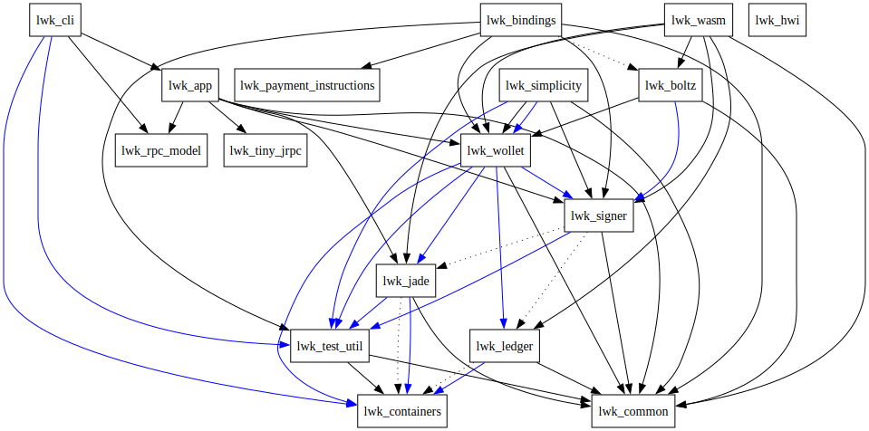

# LWK Structure

LWK functionalities are split into different component crates that might be useful independently.

* [`lwk_cli`](../lwk_cli): a CLI tool to use LWK wallets.
* [`lwk_wollet`](../lwk_wollet): library for watch-only wallets;
  specify a CT descriptor, generate new addresses, get balance,
  create PSETs and other actions.
* [`lwk_signer`](../lwk_signer): interact with Liquid signers
  to get your PSETs signed.
* [`lwk_jade`](../lwk_jade): unlock Jade, get xpubs,
  register multisig wallets, sign PSETs and more.
* [`lwk_bindings`](../lwk_bindings): use LWK from other languages.
* [`lwk_wasm`](../lwk_wasm): use LWK from WebAssembly.
* and more:
  common or ancillary components ([`lwk_common`](../lwk_common),
  [`lwk_rpc_model`](../lwk_rpc_model), [`lwk_tiny_rpc`](../lwk_tiny_rpc),
  [`lwk_app`](../lwk_app)),
  future improvements ([`lwk_hwi`](../lwk_hwi)),
  testing infrastructure ([`lwk_test_util`](../lwk_test_util),
  [`lwk_containers`](../lwk_containers))

For instance, mobile app devs might be interested mainly in
`lwk_bindings`, `lwk_wollet` and `lwk_signer`.
While backend developers might want to directly use `lwk_cli`
in their systems.

Internal crate dependencies are shown in this diagram: an arrow indicates "depends on" (when dotted the dependency is feature-activated, when blue is a dev-dependency):

(generated with `cargo depgraph --workspace-only --dev-deps | dot -Tsvg > docs/src/dep-tree.svg`)
