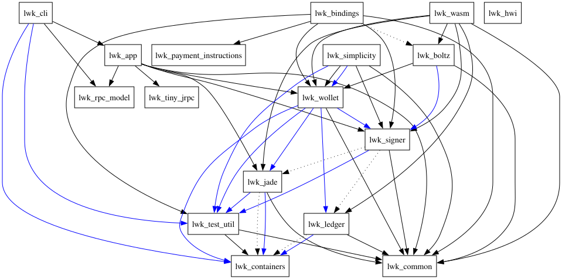

# LWK Structure

LWK functionalities are split into different component crates that might be useful independently.

* [`lwk_cli`](https://github.com/Blockstream/lwk/tree/master/lwk_cli): a CLI tool to use LWK wallets.
* [`lwk_wollet`](https://github.com/Blockstream/lwk/tree/master/lwk_wollet): library for watch-only wallets;
  specify a CT descriptor, generate new addresses, get balance,
  create PSETs and other actions.
* [`lwk_signer`](https://github.com/Blockstream/lwk/tree/master/lwk_signer): interact with Liquid signers
  to get your PSETs signed.
* [`lwk_jade`](https://github.com/Blockstream/lwk/tree/master/lwk_jade): unlock Jade, get xpubs,
  register multisig wallets, sign PSETs and more.
* [`lwk_bindings`](https://github.com/Blockstream/lwk/tree/master/lwk_bindings): use LWK from other languages.
* [`lwk_wasm`](https://github.com/Blockstream/lwk/tree/master/lwk_wasm): use LWK from WebAssembly.
* and more:
  common or ancillary components ([`lwk_common`](https://github.com/Blockstream/lwk/tree/master/lwk_common),
  [`lwk_rpc_model`](https://github.com/Blockstream/lwk/tree/master/lwk_rpc_model), [`lwk_tiny_jrpc`](https://github.com/Blockstream/lwk/tree/master/lwk_tiny_jrpc),
  [`lwk_app`](https://github.com/Blockstream/lwk/tree/master/lwk_app)),
  future improvements ([`lwk_hwi`](https://github.com/Blockstream/lwk/tree/master/lwk_hwi)),
  testing infrastructure ([`lwk_test_util`](https://github.com/Blockstream/lwk/tree/master/lwk_test_util),
  [`lwk_containers`](https://github.com/Blockstream/lwk/tree/master/lwk_containers))

For instance, mobile app devs might be interested mainly in
`lwk_bindings`, `lwk_wollet` and `lwk_signer`.
While backend developers might want to directly use `lwk_cli`
in their systems.

Internal crate dependencies are shown in this diagram: an arrow indicates "depends on" (when dotted the dependency is feature-activated, when blue is a dev-dependency):

(generated with `cargo depgraph --workspace-only --dev-deps | dot -Tsvg > docs/src/dep-tree.svg`)
