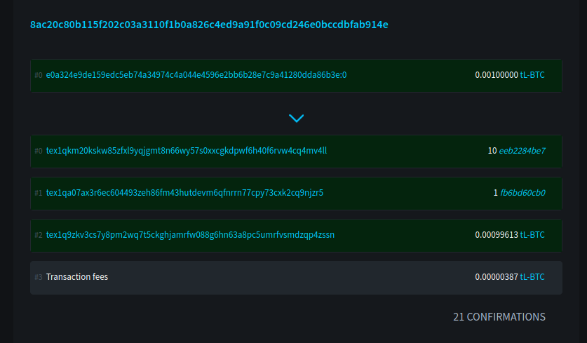

# LWK Demo

In this demo we will display some of the capabilities of **LWK**,
using `lwk_cli`.

## Multisig wallet creation:
* start a local LWK server
* create a software signer
* load a Jade signer
* create a 2of2 multisig wallet with the software signer and Jade
* get an address

## Issuance using the multisig wallet:
* receive some funds
* create a PSET issuing an asset
* sign it with the software signer
* sign it with Jade
* combine the PSETs
* broadcast the transaction

This is the [unblinded issuance transaction](https://blockstream.info/liquidtestnet/tx/8ac20c80b115f202c03a3110f1b0a826c4ed9a91f0c09cd246e0bccdbfab914e#blinded=100000,144c654344aa716d6f3abcc1ca90e5641e4e2a7f633bc09fe3baf64585819a49,eb72bab75085ab5861ac6e280977fdeb6c3c1c5f92af6a75bb6542c74d7c48fc,7804a46eb345dabbf136817e972cdacbbfe69f9641b09a3110d53e6b6f43ccf3,10,eeb2284be710e22b732416e9694e461c94da3208d4e1be7574295cd754dd766f,cf5840ee706fd12057479814ed68aa0607f1c0eb08ec2ab98640e3f806199705,df5b53c9ceff78595eaecbad828bdbc26296b08b59a7c49b86ee1ef75c28d4b5,1,fb6bd60cb0d5b91c1f41011d90f188cef9ecd61c306376b4fa61ba244874bf46,2bb129e283b713626942a6e0e2dec2c6b58d8e313ee1ebafa19964f5d55dd41b,cc94d5e59f7f1a57199d35659cbc4d91369c798eef9cb5b6c5d8ed0df9939262,99613,144c654344aa716d6f3abcc1ca90e5641e4e2a7f633bc09fe3baf64585819a49,be5a56fcb0983c32f559e9ea2a5915fd0b42bbd1e234b825638a10124f254a36,59fbe4dead525c8ca428a6cad5048a78b9d260cb26f45bcb8b2505cbee5e4549):

