# Liquid Multisig
Liquid has a very similar scripting model with respect to Bitcoin.
It allows to create complex spending conditions for your wallets.

A relatively simple, yet powerful, example is **multisig**.
In a multisig wallet you need _n_ signatures from a set of _m_ public keys to spend a wallet UTXO.

In this guide we will explain how to setup and operate a Liquid Multisig wallet.

## Setup
We want to create a _2of3_ between Alice, Bob and Carol.

First each multisig participant creates their signer.
Then they get their _xpub_, and share it with the coordinator, in this case Carol.
Carol uses the xpubs to construct the multisig CT descriptor.
Finally Carol shares the multisig CT descriptor with Alice and Bob.

```mermaid
sequenceDiagram
    participant A as Alice
    participant B as Bob
    participant C as Carol<br>(coordinator)
    Note over A: signer A 🔑
    Note over B: signer B 🔑
    Note over C: signer C 🔑
    A->>C: xpub A
    B->>C: xpub B
    C->>C: xpub C
    Note over C: Create<br>CT descriptor👀
    C->>B: CT descriptor👀
    C->>A: CT descriptor👀
```



<div class="warning">
⚠️ It's important that all participants in a multisig know the CT descriptors, as it is necessary to validate if addresses and (U)TXO belong to the wallet.
</div>

<custom-tabs category="lang">
<div slot="title">Rust</div>
<section>

```rust,ignore
```
</section>

<div slot="title">Python</div>
<section>

```python
```
</section>

<div slot="title">Javascript</div>
<section>

```typescript
```
</section>
</custom-tabs>
