# Liquid Multisig
Liquid has a very similar scripting model with respect to Bitcoin.
It allows to create complex spending conditions for your wallets.

A relatively simple, yet powerful, example is **multisig**.
In a multisig wallet you need _n_ signatures from a set of _m_ public keys to spend a wallet UTXO.

In this guide we will explain how to setup and operate a Liquid Multisig wallet.

## Setup
We want to create a _2of3_ between Alice, Bob and Carol.

First each multisig participant creates their signer.
Then they get their _xpub_, and share it with the coordinator, in this case Carol.
Carol uses the xpubs to construct the multisig CT descriptor.
Finally Carol shares the multisig CT descriptor with Alice and Bob.

```mermaid
sequenceDiagram
    participant A as Alice
    participant B as Bob
    participant C as Carol<br>(coordinator)
    Note over A: signer A 🔑
    Note over B: signer B 🔑
    Note over C: signer C 🔑
    A->>C: xpub A
    B->>C: xpub B
    C->>C: xpub C
    Note over C: Create<br>CT descriptor👀
    C->>B: CT descriptor👀
    C->>A: CT descriptor👀
```



<div class="warning">
⚠️ It's important that all participants in a multisig know the CT descriptors, as it is necessary to validate if addresses and (U)TXO belong to the wallet.
</div>

<custom-tabs category="lang">
<div slot="title">Rust</div>
<section>

```rust,ignore
{{#include ../../lwk_wollet/tests/e2e.rs:multisig-setup:ignore}}
```
</section>

<div slot="title">Python</div>
<section>

```python
{{#include ../../lwk_bindings/tests/bindings/multisig.py:multisig-setup:ignore}}
```
</section>

<div slot="title">Javascript</div>
<section>

```typescript
{{#include ../../lwk_wasm/tests/node/multisig.js:multisig-setup:ignore}}
```
</section>
</custom-tabs>

In this example Carol creates the SLIP77 key at random, however this is not mandatory and valid alternatives are:
* "elip151", to deterministically derive the descriptor blinding key from the "bitcoin" descriptor;
* derive a SLIP77 deterministic key from a signer, however this descriptor blinding key might be re used in other descriptors.

## Receive and monitor
The Liquid Multisig wallet is identified by the CT descriptor created during setup.
The descriptor encodes all the information needed to derive scriptpubkeys and blinding keys which are necessary to operate the wallet. In general, it also contains the xpubs _key origin_, information needed to by signers to sign, consisting in the signer fingerprint and derivation paths.

With the wallet CT descriptor you can:
* Generate wallet (confidential) addresses
* Get the (unblinded) list of the wallet transactions
* Get the wallet balance

<custom-tabs category="lang">
<div slot="title">Rust</div>
<section>

```rust,ignore
{{#include ../../lwk_wollet/tests/e2e.rs:multisig-receive:ignore}}
```
</section>

<div slot="title">Python</div>
<section>

```python
{{#include ../../lwk_bindings/tests/bindings/multisig.py:multisig-receive:ignore}}
```
</section>

<div slot="title">Javascript</div>
<section>

```typescript
{{#include ../../lwk_wasm/tests/node/multisig.js:multisig-receive:ignore}}
```
</section>
</custom-tabs>

Note that for generating addresses, getting transactions and balance, you have the same procedure for both singlesig and multisig wallets.

## Send
As for addresses, transactions and balance, to create a multisig transaction you only need the CT descriptor.
In this example Carol creates the transaction.
Since she created the transaction, she's comfortable in skipping validation and she also signs it.
However the wallet is a 2of3, so it needs either Alice or Bob to fully sign the transaction.
Carol sends the transaction (in PSET format) to Bob.
Bob examines the PSET and checks that it does what it's supposed to do (e.g. outgoing addresses, assets, amounts and fees), then it signs the PSET and sends it back to Carol.
The PSET is now fully signed, Carol can finalize it and broadcast the transaction.

```mermaid
sequenceDiagram
    participant A as Alice
    participant B as Bob
    participant C as Carol<br>(coordinator)
    Note over C: Create PSET<br>(using CT descriptor👀)
    Note over C: signer C 🔑 signs PSET
    C->>B: PSET
    Note over B: Analyze PSET<br>(using CT descriptor👀)
    Note over B: signer B 🔑 signs PSET
    B->>C: PSET
    Note over C: Finalize PSET and<br>extract TX
    Note over C: Broadcast TX
```



<custom-tabs category="lang">
<div slot="title">Rust</div>
<section>

```rust,ignore
{{#include ../../lwk_wollet/tests/e2e.rs:multisig-send:ignore}}
```
</section>

<div slot="title">Python</div>
<section>

```python
{{#include ../../lwk_bindings/tests/bindings/multisig.py:multisig-send:ignore}}
```
</section>

<div slot="title">Javascript</div>
<section>

```typescript
```
</section>
</custom-tabs>

<div class="warning">
⚠️ Bob needs the CT descriptor to obtain the PSET details, in particular the net balance with respect to the wallet, i.e. how much is being sent out of the wallet.
</div>

In this example we went through an example where the coordinator is one of the multisig participants and the PSET is signed serially. In general, this is not the case.
The coordinator can be a utility service, as long as it knows the multisig CT descriptor.
Also the PSET can be signed in parallel, and in this case the coordinator must combine the signed PSET using `Wollet::combine()`.
